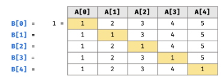

# 仓库管理问题

## LCR库存管理I（2）

> Problem: [LCR 128. 库存管理 I](https://leetcode.cn/problems/xuan-zhuan-shu-zu-de-zui-xiao-shu-zi-lcof/description/)

### 思路——二分

> 这题有个有序的条件，所以优先选择二分，那么核心问题就是如何判断每次取到的中间节点是在最小值左边还是右边
>
> 我们都知道左侧和右侧都是递增的，而且左侧的值一定都大于等于右侧的值，于是最终答案一定不会大于当前区间的最右侧值，所以我们可以以右边界为基准，
>
> 假如中间值大于了右边界，那么肯定是在答案的右侧，于是mid以及mid左侧都可以放弃了
>
> 假如中间值小于了右边界，说明当前已经在右侧区间中了，而且当前值也可能是答案，于是mid右侧可以放弃，mid仍然保留
>
> 如果相等，那么即使右端是答案，那么mid也可以给出同样的替代方案，于是右端点可以舍弃

### 复杂度分析

- 时间

	总共只进行了一轮二分查找，于是时间复杂度为$O(logn)$

- 空间

	二分查找只依赖于几个临时变量，于是空间复杂度为$O(1)$

### Code

```c++
class Solution {
public:
    int stockManagement(vector<int>& stock) {
        int l = 0, r = stock.size() - 1;
        int m;
        while (l < r) {
            m = l + r >> 1;
            if (stock[m] < stock[r]) r = m;
            else if (stock[m] > stock[r]) l = m + 1;
            else --r;
        }
        return stock[l];
    }
};
```

---

### 第二次出错

> 选取基准值错误，应该选择右端点进行比较，导致编码判断过于复杂出现漏洞

## LCR 库存管理 II

> Problem: [LCR 158. 库存管理 II](https://leetcode.cn/problems/shu-zu-zhong-chu-xian-ci-shu-chao-guo-yi-ban-de-shu-zi-lcof/description/)

### 思路1——hash

> 这题一上来第一个最好想到的肯定是hash计数，直接记录下每个数出现的次数，大于一半就输出就完事了

#### 复杂度分析

- 时间

	时间上只需要遍历一遍数组，为$O(n)$

- 空间

	空间上主要用于hash存数组，为$O(n)$

#### Code

```c++
class Solution {
public:
    int inventoryManagement(vector<int>& stock) {
        int ssr = stock.size() / 2;
        unordered_map<int, int> cnt;
        for (int x: stock) if (++cnt[x] > ssr) return x;
        return 0;
    }
};
```

---

### 思路2——摩尔投票

> 核心思想为正负抵消，我们可以记录一下当前数量最多的数为多少，以及出现了多少次，如果遇到不是该数的数字，则$计数-1$

#### 合理性

> 因为答案肯定存在，则数量最大的数一定数量大于一半，无论怎么抵消，最终一定能存活下来，其他的数就算怎么相互抵消也不会影响最终答案的正确性

#### 复杂度分析

- 时间

	时间上只需要遍历一遍数组，为$O(n)$

- 空间

	空间上只需要记录最大数以及相应的计数，为$O(1)$

#### Code

```c++
class Solution {
public:
    int inventoryManagement(vector<int>& stock) {
        int cnt = 0, ans = 0;
        for (int x: stock) 
            if (x == ans) ++cnt;
            else if (--cnt < 0) cnt = 1, ans = x;
        return ans;
    }
};
```

---

## LCR仓库管理III

> Problem: [LCR 159. 库存管理 III](https://leetcode.cn/problems/zui-xiao-de-kge-shu-lcof/description/)

### 总体思路

> 这题可以根据我们取第K大的经验来做，套路都是一样的方法也是类似，核心就在于排序，和排序时的处理

### 思路1——直接排序

> 这个很好理解，直接将整个数组进行排序，然后取前cnt个即可

#### 复杂度分析

- 时间

	时间主要用在排序上，对于整个数组排序时间复杂度为$O(nlogn)$，所以总的时间复杂度也为$O(nlogn)$

- 空间

	空间也就用在排序上，需要$O(logn)$层的栈空间，所以空间复杂度为$O(logn)$

#### Code

```c++
class Solution {
public:
    vector<int> inventoryManagement(vector<int>& stock, int cnt) {
        sort(stock.begin(), stock.end());
        vector<int> ans;
        for (int i = 0; i < cnt; ++i) ans.emplace_back(stock[i]);
        return ans;
    }
};
```

---

### 思路2——堆排序

> 我们可以维护一个大小为cnt的大顶堆，由于优先队列默认就为大顶堆，于是我们直接用优先队列处理即可
>
> 遍历数组中的每个元素，放入堆中，一旦超过大小则弹出堆顶元素

#### 复杂度分析

- 时间

	时间上的限制在每次需要维护堆，而维护一次的成本为$O(log(cnt))$，每进入一个数字都得维护，所以总的时间复杂度为$O(nlog(cnt))$

- 空间

	空间复杂度主要在于维护这个堆，所以需要$O(cnt)$的空间复杂度

#### Code

```c++
class Solution {
public:
    vector<int> inventoryManagement(vector<int>& stock, int cnt) {
        priority_queue<int> q;
        for (int x: stock) {
            q.emplace(x);
            if (q.size() > cnt) q.pop();
        }
        vector<int> ans;
        while (q.size()) ans.emplace_back(q.top()), q.pop();
        return ans;
    }
};
```

---

### 思路3——快排

> 这个应用和快速选择相似，我们在每次选取的时候可以根据最终分界处的位置选择放弃一边区间不去维护，相比于其他的排序，这个方法在最终并没有实现完全的排序，于是最终的时间复杂度也更优秀
>
> 题目上也没有要求按照什么顺序返回，于是这种方案非常的香

#### 复杂度分析

- 时间

	这里时间复杂度的期望为$O(n)$是目前方案中最快的，证明过程繁琐。但是在最差的情况下死犟复杂度为$O(n^2)$，具体原因可以参照快速排序，每次划分的点都比较差劲

- 空间

	空间上属于原地的操作，没有额外的开销，但是在递归调用函数的时候用到了栈，所以空间复杂度应该为递归的层数，也就是$O(logn)$，这是期望的时间复杂度，然而最坏的情况下分了n次，就需要$O(n)$的空间复杂度

#### Code

```c++
class Solution {
    void yyds(int l, int r, vector<int>& stock, const int& cnt)
    {
        if (l >= r) return;
        int ssr = stock[l];
        int i = l - 1, j = r + 1;
        while (i < j) {
            do ++i; while (stock[i] < ssr);
            do --j; while (stock[j] > ssr);
            if (i < j) swap(stock[i], stock[j]);
        }
        if (j >= cnt) yyds(l, j, stock, cnt);
        else yyds(j + 1, r, stock, cnt);
    }

public:
    vector<int> inventoryManagement(vector<int>& stock, int cnt) {
        yyds(0, stock.size() - 1, stock, cnt);
        while (stock.size() > cnt) stock.pop_back();
        return stock;
    }
};
```

---

# 训练计划

## LCR 139. 训练计划 I

> Problem: [LCR 139. 训练计划 I](https://leetcode.cn/problems/diao-zheng-shu-zu-shun-xu-shi-qi-shu-wei-yu-ou-shu-qian-mian-lcof/description/)

### 思路

> 这题最优的解法就是直接用双指针来解决，一个指针从前走，一个从后走，类似于快排的思路

### 复杂度

- 时间

	两个指针总共只需要将整个数组遍历一遍，于是是$O(n)$

- 空间

	空间上只依赖于两个新指针，空间复杂度为$O(1)$

### Code

```c++
class Solution {
public:
    vector<int> trainingPlan(vector<int>& actions) {
        int i = -1, j = actions.size();
        while (i < j) {
            do ++i; while (i < j && actions[i] % 2);
            do --j; while (i < j && actions[j] % 2 == 0);
            if (i < j) swap(actions[i], actions[j]);
        }
        return actions;
    }
};
```

---

## LCR 140. 训练计划 II

> Problem: [LCR 140. 训练计划 II](https://leetcode.cn/problems/lian-biao-zhong-dao-shu-di-kge-jie-dian-lcof/description/)

### 思路1——暴力计数

> 这个思路非常暴力，通过遍历一遍链表求得链表的长度$n$，然后跳跃$n - cnt$次返回答案

#### 复杂度

- 时间

	需要将链表遍历一遍测长度，第二次跳跃，最坏情况需要遍历两遍链表，于是是$O(n)$

- 空间

	空间上只有几个临时变量存储信息，空间复杂度为$O(1)$

#### Code

```c++
/**
 * Definition for singly-linked list.
 * struct ListNode {
 *     int val;
 *     ListNode *next;
 *     ListNode() : val(0), next(nullptr) {}
 *     ListNode(int x) : val(x), next(nullptr) {}
 *     ListNode(int x, ListNode *next) : val(x), next(next) {}
 * };
 */
class Solution {
public:
    ListNode* trainingPlan(ListNode* head, int cnt) {
        ListNode* ssr = head;
        int n = 0;
        while (ssr) ++n, ssr = ssr->next;
        n -= cnt;
        while (n--) head = head->next;
        return head;
    }
};
```

---

### 思路2——栈

> 栈的结构是后进先出，所以我们可以将所有节点压入栈，然后反向弹出

#### 复杂度

- 时间

	需要将链表遍历一遍压栈，再反向弹出，最坏情况需要遍历两遍链表，于是是$O(n)$

- 空间

	栈的空间需要记录整个链表，空间复杂度为$O(n)$

#### Code

```c++
/**
 * Definition for singly-linked list.
 * struct ListNode {
 *     int val;
 *     ListNode *next;
 *     ListNode() : val(0), next(nullptr) {}
 *     ListNode(int x) : val(x), next(nullptr) {}
 *     ListNode(int x, ListNode *next) : val(x), next(next) {}
 * };
 */
class Solution {
public:
    ListNode* trainingPlan(ListNode* head, int cnt) {
        stack<ListNode*> s;
        while (head) {
            s.emplace(head);
            head = head->next;
        }
        for (int i = 1; i < cnt; ++i) s.pop();
        return s.top();
    }
};
```

---

### 思路3——快慢指针

> 思路三比较巧妙，先让快指针跳cnt次，接着两个指针一起跳，当快指针出去时，慢指针刚好就是答案

#### 复杂度

- 时间

	最差也只需要快指针遍历一遍链表，于是是$O(n)$

- 空间

	空间上只有几个临时变量存储信息，空间复杂度为$O(1)$

#### Code

```c++
/**
 * Definition for singly-linked list.
 * struct ListNode {
 *     int val;
 *     ListNode *next;
 *     ListNode() : val(0), next(nullptr) {}
 *     ListNode(int x) : val(x), next(nullptr) {}
 *     ListNode(int x, ListNode *next) : val(x), next(next) {}
 * };
 */
class Solution {
public:
    ListNode* trainingPlan(ListNode* head, int cnt) {
        ListNode* ssr = head;
        while (cnt--) ssr = ssr->next;
        while (ssr) head = head->next, ssr = ssr->next;
        return head;
    }
};
```

---

## LCR 141. 训练计划 III

> Problem: [LCR 141. 训练计划 III](https://leetcode.cn/problems/fan-zhuan-lian-biao-lcof/description/)

### 思路1——递归

> 递归可以实现类似栈的功能，对于这种逆序的题，递归在归的过程中改变方向即可

#### 复杂度

- 时间

	遍历到底再返回，于是是$O(n)$

- 空间

	递归的栈需要存储n层，空间复杂度为$O(n)$

#### Code

```c++
/**
 * Definition for singly-linked list.
 * struct ListNode {
 *     int val;
 *     ListNode *next;
 *     ListNode() : val(0), next(nullptr) {}
 *     ListNode(int x) : val(x), next(nullptr) {}
 *     ListNode(int x, ListNode *next) : val(x), next(next) {}
 * };
 */
class Solution {
    ListNode* ans;
    void yyds(ListNode* p, ListNode* pre)
    {
        if (p) yyds(p->next, p);
        else {
            ans = pre;
            return;
        }
        p->next = pre;
    }
public:
    ListNode* trainningPlan(ListNode* head) {
        yyds(head, nullptr);
        return ans;
    }
};
```

---

### 思路2——快慢指针

> 我们可以用三个指针一前一后做存储，一遍遍历就完事了

#### 复杂度

- 时间

	遍历一遍链表，于是是$O(n)$

- 空间

	只需要存储几个指针，空间复杂度为$O(n)$

#### Code

```c++
/**
 * Definition for singly-linked list.
 * struct ListNode {
 *     int val;
 *     ListNode *next;
 *     ListNode() : val(0), next(nullptr) {}
 *     ListNode(int x) : val(x), next(nullptr) {}
 *     ListNode(int x, ListNode *next) : val(x), next(next) {}
 * };
 */
class Solution {
public:
    ListNode* trainningPlan(ListNode* head) {
        if (head) {
            ListNode* ssr = head->next;
            ListNode* p = nullptr;
            while (ssr) {
                head->next = p;
                p = head;
                head = ssr;
                ssr = ssr->next;
            }
            head->next = p;
        }
        return head;
    }
};
```

---

## LCR 142. 训练计划 IV

> Problem: [LCR 142. 训练计划 IV](https://leetcode.cn/problems/he-bing-liang-ge-pai-xu-de-lian-biao-lcof/description/)

### 思路

> 定义一个临时的头结点和尾结点，头结点用来返回，尾结点用于处理连接，将两个链表一个个比较即可

### 复杂度

- 时间

	时间上最差只需要完整遍历完两个链表即可，$O(m + n)$

- 空间

	空间上也只需要引入两个指针，$O(1)$

### Code

```c++
/**
 * Definition for singly-linked list.
 * struct ListNode {
 *     int val;
 *     ListNode *next;
 *     ListNode() : val(0), next(nullptr) {}
 *     ListNode(int x) : val(x), next(nullptr) {}
 *     ListNode(int x, ListNode *next) : val(x), next(next) {}
 * };
 */
class Solution {
public:
    ListNode* trainningPlan(ListNode* l1, ListNode* l2) {
        ListNode* end, *head;
        if (!l1) return l2;
        if (!l2) return l1;
        if (l1->val < l2->val) head = end = l1, l1 = l1->next;
        else head = end = l2, l2 = l2->next;
        while (l1 && l2) {
            if (l1->val < l2->val) end->next = l1, end = l1, l1 = l1->next;
            else end->next = l2, end = l2, l2 = l2->next;
        }
        end->next = l1 ? l1 : l2;
        return head;
    }
};
```

---

## LCR 171. 训练计划 V

> Problem: [LCR 171. 训练计划 V](https://leetcode.cn/problems/liang-ge-lian-biao-de-di-yi-ge-gong-gong-jie-dian-lcof/description/)

### 思路1——hash

> 我们可以先遍历一遍其中一个表，然后将所有经过的节点记录下来
>
> 然后再遍历第二个链表，一旦遇到记录过的节点那就是第一个相遇点，直接可以返回

#### 复杂度

- 时间

	时间上只需要最多遍历完两个链表，也就是$O(m + n)$

- 空间

	空间上则需要存储其中一个链表，$O(n)$

#### Code

```c++
/**
 * Definition for singly-linked list.
 * struct ListNode {
 *     int val;
 *     ListNode *next;
 *     ListNode(int x) : val(x), next(NULL) {}
 * };
 */
class Solution {
public:
    ListNode *getIntersectionNode(ListNode *headA, ListNode *headB) {
        unordered_set<ListNode*> s;
        while (headA) s.insert(headA), headA = headA->next;
        while (headB) if (s.count(headB)) return headB;
        else headB = headB->next;
        return nullptr;
    }
};
```

---

### 思路2——栈

> 将两个链表遍历完，分别用一个栈来记录，然后一起出栈，最后一个相同的出栈元素就是第一个相遇的点

#### 复杂度

- 时间

	时间上需要遍历完两个链表，然后再弹出元素，也就是$O(m + n + min(m, n))$

- 空间

	空间上需要存储两个栈，$O(n + m)$

#### Code

```c++
/**
 * Definition for singly-linked list.
 * struct ListNode {
 *     int val;
 *     ListNode *next;
 *     ListNode(int x) : val(x), next(NULL) {}
 * };
 */
class Solution {
public:
    ListNode *getIntersectionNode(ListNode *headA, ListNode *headB) {
        stack<ListNode*> s1, s2;
        ListNode* ans = nullptr;
        while (headA) s1.emplace(headA), headA = headA->next;
        while (headB) s2.emplace(headB), headB = headB->next;
        while (s1.size() && s2.size() && s1.top() == s2.top()) ans = s1.top(), s1.pop(), s2.pop();
        return ans;
    }
};
```

---

### 思路3——差值追逐

> 可以先遍历完两个链表，然后使用双指针，根据差值让其中一个长的先跑，最终就能一起到第一个相遇节点

#### 复杂度

- 时间

	时间上需要遍历完两个链表，然后开始跑，也就是$O(m + n + min(m, n))$

- 空间

	空间上只需要几个局部变量，$O(1)$

#### Code

```c++
/**
 * Definition for singly-linked list.
 * struct ListNode {
 *     int val;
 *     ListNode *next;
 *     ListNode(int x) : val(x), next(NULL) {}
 * };
 */
class Solution {
public:
    ListNode *getIntersectionNode(ListNode *headA, ListNode *headB) {
        ListNode* ssr = headA;
        int cnta = 0, cntb = 0;
        while (ssr) ++cnta, ssr = ssr->next;
        ssr = headB;
        while (ssr) ++cntb, ssr = ssr->next;
        while (cnta < cntb) headB = headB->next, ++cnta;
        while (cntb < cnta) headA = headA->next, ++cntb;
        while (headA && headB && headA != headB) headA = headA->next, headB = headB->next;
        return headA;
    }
};
```

---

### 思路4——浪漫相遇

> 这算是一个非常浪漫的题解了，我们来分析一下原理。
>
> 两个链表的相遇后的部分是一样长的，差在了前面的那段路，但是如果每个点都将自己的路之后走对方的路，那么每个接节点都走了自己的前半部分和对方的前半部分加上相同的相遇部分，所以一定是相等的能同时到达
>
> 如果双方没有相遇节点，那么最终都会完整走完两段路，所以时间一定是一样的，最终都会在null相遇

#### 复杂度

- 时间

	时间上需要遍历完两个链表，然后开始跑，也就是$O(2(m+n))$

- 空间

	空间上只需要几个局部变量，$O(1)$

#### Code

```c++
/**
 * Definition for singly-linked list.
 * struct ListNode {
 *     int val;
 *     ListNode *next;
 *     ListNode(int x) : val(x), next(NULL) {}
 * };
 */
class Solution {
public:
    ListNode *getIntersectionNode(ListNode *headA, ListNode *headB) {
        ListNode* a = headA;
        ListNode* b = headB;
        while (a != b) {
            a = a ? a->next : headB;
            b = b ? b->next : headA;
        }
        return a;
    }
};
```

---

## LCR 178. 训练计划 VI

> Problem: [LCR 178. 训练计划 VI](https://leetcode.cn/problems/shu-zu-zhong-shu-zi-chu-xian-de-ci-shu-ii-lcof/description/)

### 思路1——hash计数

> 直接用hash把每个数字出现的次数记录下来，再遍历一遍这个hash数组，出现了一次的数字就是答案

#### 复杂度

- 时间

	时间只需要跑完整个数组，然后再跑一遍hash数组即可，为$O(\frac 4 3 n)$

- 空间

	空间上需要记录一个hash数组，$O(\frac 1 3 n)$

#### Code

```c++
class Solution {
public:
    int trainingPlan(vector<int>& actions) {
        unordered_map<int, int> cnt;
        for (int x: actions) ++cnt[x];
        for (const auto& [x, y]: cnt) if (y == 1) return x;
        return 0;
    }
};
```

---

### 思路2——排序

> 我们可以先对数组进行一遍排序，然后由于相同的数字都凑在一起，所以我们判断次数的时候和旁边的比较即可

#### 复杂度

- 时间

	时间主要在排序上，$O(nlogn)$

- 空间

	空间上也是需要排序空间，$O(logn)$

#### Code

```c++
class Solution {
public:
    int trainingPlan(vector<int>& actions) {
        sort(actions.begin(), actions.end());
        for (int i = 0; i < actions.size() - 1; ++i) if (actions[i] == actions[i + 1]) i += 2;
        else return actions[i];
        return actions[actions.size() - 1];
    }
};
```

---

### 方法3——处理位

> 这是基于hash计数的优化，我们其实不用记录下每个数字出现了多少次，只需要记录下每个二进制位出现了多少次，最后对每个位的次数取模3即可，余数也只可能是1或0，所以不用担心

#### 复杂度

- 时间

	时间只需要跑完整个数组，然后对每个数的位的统计最多只有32位，于是时间复杂度为$O(32n)=O(n)$

- 空间

	空间上只需要记录32位，所以为$O(32)=O(1)$

#### Code

```c++
class Solution {
public:
    int trainingPlan(vector<int>& actions) {
        int cnt[32];
        for (int x: actions) {
            int k = 0;
            while (x) cnt[k] = (cnt[k] + (x & 1)) % 3, x >>= 1, ++k;
        }
        int ans = 0;
        for (int i = 31; i >= 0; --i) {
            ans <<= 1;
            ans += cnt[i];
        }
        return ans;
    }
};
```

---

# 数组

## LCR 160. 数据流中的中位数

> Problem: [LCR 160. 数据流中的中位数](https://leetcode.cn/problems/shu-ju-liu-zhong-de-zhong-wei-shu-lcof/description/)

### 思路——对顶堆

> 对顶堆裸的板子题，用一个小堆维护大的半边，用一个大堆维护小的那边，保持他们的大小差不超过1。那么他们的堆顶就是中位数

### Code

```c++
class MedianFinder {
public:
    /** initialize your data structure here. */
    priority_queue<int> big;
    priority_queue<int, vector<int>, greater<int>> small;
    MedianFinder() {

    }
    
    void addNum(int num) {
        if (small.size() && num > small.top()) small.emplace(num);
        else big.emplace(num);
        if (big.size() > small.size() + 1) {
            int t = big.top(); big.pop();
            small.emplace(t);
        }
        if (small.size() > big.size()) {
            int t = small.top(); small.pop();
            big.emplace(t);
        }
    }
    
    double findMedian() {
        if (big.size() == small.size()) return ((double)big.top() + small.top()) / 2;
        return big.top();
    }
};

/**
 * Your MedianFinder object will be instantiated and called as such:
 * MedianFinder* obj = new MedianFinder();
 * obj->addNum(num);
 * double param_2 = obj->findMedian();
 */
```

---

## LCR 164. 破解闯关密码

> Problem: [LCR 164. 破解闯关密码](https://leetcode.cn/problems/ba-shu-zu-pai-cheng-zui-xiao-de-shu-lcof/description/)

### 思路

> 这题主要在于排序，考虑两个字符串谁应该在前谁应该在后只需要将他们的这两种排列都尝试一下，然后用小的那个就行了
>
> 对于使用C++的，学会用函数`to_string`这题就可以直接秒了，直接将数字转化成`string`然后拼接，没有任何难度

### Code

```c++
class Solution {
public:
    string crackPassword(vector<int>& password) {
        sort(password.begin(), password.end(), [&](int a, int b) {
            string x = to_string(a), y = to_string(b);
            return x + y < y + x;
        });
        string ans = "";
        for (int x: password) ans += to_string(x);
        return ans;
    }
};
```

---

## LCR 168. 丑数

> Problem: [LCR 168. 丑数](https://leetcode.cn/problems/chou-shu-lcof/description/)

### 思路1-暴力推导

> 最早的思路是遍历每一个数，直到丑数的个数达到1690为止，对于每个数字通过判断其有没有2,3,5以外的质因子
>
> 但后来发现，越到后面跨度越大，两个丑数之间可能差了很多，没满1600呢，已经超时了
>
> 所以这是一个废案

### 思路2-set

> 既然无法遍历数字，那么就反着来思考，假如一个数字是丑数，那么说明它只有2,3,5为质因子，假如让这个数除2或3或5，那么商必定也是一个丑数，所以可得，丑数乘2,3,5会是另一个丑数
>
> 于是现在的方案变成了正向通过丑数推未知的丑数，这样数字跨度跳跃就很大了，因为题目给了最大1690，所以取得前1690个丑数即可。
>
> 为了保证数字尽量是有序的，我们在求的过程中直接从已知的丑数从小到大往后推，但是避免不了肯定还会和后面的有重复的，因为$num[i] < num[j] \and i < j$并不能使得$num[i] * 5 < num[j] * 2$
>
> 于是乎我们如果将数字刚好卡1690肯定是会有比较大的误差的，保险起见我开了1800，多开了一百多个数确保前1690在里面
>
> 然后又找了个同时可以解决排序和去重的数据结构，也就是`set`来完成

#### Code

```c++
using ll = long long;

set<ll> ug;
vector<int> ans;

auto yyds = [] () {
    ug.insert(1);
    auto it = ug.begin();
    while (ug.size() < 1800) {
        ll x = *it;
        ug.insert(x * 2);
        ug.insert(x * 3);
        ug.insert(x * 5);
        ++it;
    }
    it = ug.begin();
    for (int i = 0; i < 1690; ++i, ++it) ans.emplace_back(*it); 
    return 0;
}();

class Solution {
public:
    int nthUglyNumber(int n) {
        return ans[n - 1];
    }
};
```

---

### 思路3-动态规划

> 其实对于这种重复的问题我们还有其他的解决方案，我们可以用三个指针将需要乘的质因数分开来思考，定义$dp[i]$为第i个丑数，那么状态转移方程为
> $$
> dp[i] = min(dp[p_x]*x) \and x = 2,3,5
> $$
> 其中$p_x$代表对应乘x的指针指向的下标，含义是使得$dp[j] * x > dp[i - 1]$的最小下标
>
> 初始化：
> $$
> \begin{cases}
> dp[0] = 1; \\
> p_x = 0 & x = 2, 3, 5
> \end{cases}
> $$
> 每次都通过得到的最小的值进行转移，同时将对应相等值的指针往后移动

#### Code

```c++
using ll = long long;

ll ans[1691];

auto yyds = [] () {
    ans[0] = 1;
    int i, j, k;
    i = j = k = 0;
    for (int z = 1; z <= 1690; ++z) {
        ll a = ans[i] * 2, b = ans[j] * 3, c = ans[k] * 5;
        int mi = min({a, b, c});
        ans[z] = mi;
        if (mi == a) ++i;
        if (mi == b) ++j;
        if (mi == c) ++k;
    }
    return 0;
}();

class Solution {
public:
    int nthUglyNumber(int n) {
        return ans[n - 1];
    }
};
```

---

## LCR 170. 交易逆序对的总数

> Problem: [LCR 170. 交易逆序对的总数](https://leetcode.cn/problems/shu-zu-zhong-de-ni-xu-dui-lcof/description/)

### 思路1-归并排序

> 归并排序与逆序对的契合度是相当的高，因为逆序对其实也可以分区间考虑，每次归并排序对于子区间的处理中就可以顺便将子区间的逆序对处理完毕，随着回溯过程的进行，各个大区间之间的逆序对也就处理完成了
>
> 具体如何处理一个区间的逆序对：
>
> 该区间首先会被分为左区间和右区间，在排序时左区间的数会和右区间的数进行比较，我们定义
> $$
> \begin{cases}
> l=左区间左边界 \\
> m=左区间右边界 \\
> m+1=右区间左边界 \\
> r=右区间右边界 \\
> i为左区间某下标，j为右区间某下标 \\
> a为原数组
> \end{cases}
> $$
> 假如此时$a[i] > a[j]$
>
> 此时我们有两种思路：
>
> 1. 当$a[i] > a[j]$去记录，因为$a[t]>a[i] \and i<t<=m$所以$a[t]>a[j] \and i<t<=m$；也就是说，此时$a[j]$对于左区间$[i, m]$的逆序对都有贡献，且也只对这个区间有贡献。于是可以根据这个为依据来记录逆序对的个数。但是这个在记录的时候要注意，别在左区间空的时候加入的右区间值也算进去了，记得要特判的！！！
> 2. 当$a[i] <= a[j]$时去记录，因为$a[j] < a[s] \and j < s <= r$，所以既然$a[i] < a[j]$，那么$a[i] < a[s]$也是理所应当的，也就是说$a[i]$的使命就到这了，在当前区间内的逆序对不会再多了，也就直接将此时右区间的前半部分（$[m + 1, j)$）贡献给$a[i]$。这是不需要加啥特判的，因为$a[i]$是在右侧大了或者右区间空了才计数的，无论怎样，右区间的前半部分就是$a[i]$”合情合理赢来的“，自然是要加贡献的

#### 复杂度

- 时间

	时间复杂度和归并排序一样，总的操作也就多了一个计数，所以时间没啥压力，$O(nlogn)$

- 空间

	空间主要也是归并排序依赖于外部额外的临时数组，于是是$O(n)$

#### Code

> 这里采用了不用特判的第二种

```c++
class Solution {
    int ans = 0;
    vector<int> t;

    void merge(int l, int r, vector<int>& record)
    {
        if (l >= r) return;
        int m = l + r >> 1;
        merge(l, m, record), merge(m + 1, r, record);
        int p = l, q = m + 1, s = l;
        while (p <= m || q <= r) {
            if (q > r || p <= m && record[p] <= record[q]) {
                ans += q - m - 1;
                t[s++] = record[p++];
            } 
            else {
                t[s++] = record[q++];
            }
        }
        for (int i = l; i <= r; ++i) record[i] = t[i];
    }

public:
    int reversePairs(vector<int>& record) {
        int n = record.size();
        t.resize(n);
        merge(0, n - 1, record);
        return ans;
    }
};
```

---

### 思路2-树状数组+离散化

> 每谈到逆序对总是第一时间想到归并排序和树状数组~~某种奇怪的条件反射~~。树状数组也是解决逆序对的一把利器，特别是其中的动态处理非常精妙的
>
> 不了解树状数组的可以去看看~~或者不去看也没事，这玩意找工作几乎用不到~~，这里不具体讲啥是树状数组，只需要知道它非常基础的一个功能是动态的可以求解区间和问题，这题我们可以将逆序对的贡献抽象成区间和问题，所谓逆序对就是前面的值比后面大就是一个逆序对，我们可以顺着处理或者逆着处理，这里以顺着处理为例
>
> 逆序对的贡献从前面的值来，而且是从前面大的值来，所以我们每遍历到一个值，则对于小于该值的所有区间都有贡献，求和的时候就反向求取所有大于该值的个数和，由于都是前面出现的值才进行记录的，所以不太需要考虑逆序对的顺序约束，只需要管大小，然后这里求的和又全是大于该值的，所以这不纯纯就是完美契合嘛
>
> hold on please！你以为结束了？还没完呢，这题直接这么裸着上怎么死的都不知道。这题有个很坑的点，压根没有给数据范围，只给了个数，我们的树状数组实际上也是基于值的区间控制，下标映射全都是跟值有关的，稍微给几个负数，下标都随便越界re吃到饱
>
> 好在数据范围给的还是比较友善的，才1e5，假如我们通过离散化将每个数字再做映射，那么总共的区间也就限制在1e5之内了，最终维护树状数组也不会太大。因为逆序对与值的大小无关，所以随便离散化。
>
> 哈哈哈这就完事了？能过了？不能！还有些细节要注意，`lowbit`最怕的就是0，因此树状数组最怕的也是0，所以即使离散化了也要稍微留点余量，多开几个数，不然出个0就等着原地死循环一直t吧哈哈哈

#### 复杂度

- 时间

	离散化复杂度主要在排序上，也就是$O(nlogn)$，而树状数组的维护和查询均为$log$级别的总共处理完n个数也就$O(nlogn)$，所以总的时间复杂度为$O(nlogn)$

- 空间

	空间上不仅离散化需要克隆一个原数组，对于后来维护的树状数组同样范围也是那么大，去重操作去掉的几个就忽略不计了，所以空间复杂度为$O(n)$

#### Code

```c++
class Solution {
    vector<int> t;
    int n;

    inline int lowbit(int x)
    {
        return x & -x;
    }

    void add(int x)
    {
        for (; x; x -= lowbit(x)) ++t[x];
    }

    int query(int x)
    {
        int res = 0;
        for (; x <= n; x += lowbit(x)) res += t[x];
        return res;
    }

public:
    int reversePairs(vector<int>& record) {
        int ans = 0;

        // 离散化
        vector<int> ssr(record);
        sort(ssr.begin(), ssr.end());
        n = unique(ssr.begin(), ssr.end()) - ssr.begin();

        auto find = [&] (int x) {
            int l = 0, r = n - 1;
            while (l <= r) {
                int m = l + r >> 1;
                if (ssr[m] == x) return m + 2;
                else if (ssr[m] < x) l = m + 1;
                else r = m - 1;
            }
            return 233;
        };

        t.resize(n + 2);
        for (int i = 0; i < record.size(); ++i) ans += query(find(record[i])), add(find(record[i]) - 1);
        return ans;
    }
};
```

---

## LCR 172. 统计目标成绩的出现次数

> Problem: [LCR 172. 统计目标成绩的出现次数](https://leetcode.cn/problems/zai-pai-xu-shu-zu-zhong-cha-zhao-shu-zi-lcof/description/)

### 思路1——暴力

> 直接将整个数组遍历一遍，碰到target就计数，无脑暴力完事

#### 复杂度

- 时间

	遍历一遍数组的时间，$O(n)$

- 空间

	就记录一个答案，$O(1)$

#### Code

```c++
class Solution {
public:
    int countTarget(vector<int>& scores, int target) {
        int cnt = 0;
        for (int x: scores) cnt += x == target;
        return cnt;
    }
};
```

---

### 思路2——二分

> 由于题目给的是有序的数组，然而我们并没有用上这个重要的条件，即使是无序数组暴力也能跑，但是有序数组更优秀的查找应该是二分，我们分别通过二分找到target第一次出现的位置和最后一次出现的位置，就能马上算出数量

#### 复杂度

- 时间

	只需要进行两次二分，和最后一次算答案，所以时间复杂度为$O(logn)$

- 空间

	只用到几个临时变量，$O(1)$

#### Code

```c++
class Solution {
public:
    int countTarget(vector<int>& scores, int target) {
        int n = scores.size();
        int l = 0, r = n - 1;
        while (l <= r) {
            int m = l + r >> 1;
            if (scores[m] >= target) r = m - 1;
            else l = m + 1;
        }
        if (l >= n || scores[l] != target) return 0;
        int first = l;
        l = 0, r = n - 1;
        while (l <= r) {
            int m = l + r >> 1;
            if (scores[m] <= target) l = m + 1;
            else r = m - 1;
        }
        return r - first + 1;
    }
};
```

---

#### 范围优化

> 实际上在我们算出左边界或右边界后，第二次求另一个边界我们不需要将整个区间都用进来，
>
> 假如我们已经有了左边界，那么说明该下标就是第一个target，左边不可能有其他target，可以直接舍弃l的左半部分

##### 复杂度

- 时间

	同普通二分，$O(logn)$

- 空间

	同普通二分，$(1)$

##### Code

```c++
class Solution {
public:
    int countTarget(vector<int>& scores, int target) {
        int n = scores.size();
        int l = 0, r = n - 1;
        while (l <= r) {
            int m = l + r >> 1;
            if (scores[m] >= target) r = m - 1;
            else l = m + 1;
        }
        if (l >= n || scores[l] != target) return 0;
        int first = l;
        r = n - 1;
        while (l <= r) {
            int m = l + r >> 1;
            if (scores[m] <= target) l = m + 1;
            else r = m - 1;
        }
        return r - first + 1;
    }
};
```

---

## LCR 173. 点名

> Problem: [LCR 173. 点名](https://leetcode.cn/problems/que-shi-de-shu-zi-lcof/description/)

### 思路1——暴力

> 因为数组是有序的从0开始的，则我们直接暴力跑一遍数组，找到第一个不等于自己下标的数就行

#### 复杂度

- 时间

	遍历一遍数组的时间，$O(n)$

- 空间

	就记录一个答案，$O(1)$

#### Code

```c++
class Solution {
public:
    int takeAttendance(vector<int>& records) {
        for (int i = 0; i < records.size(); ++i) if (records[i] != i) return i;
        return records.size();
    }
};
```

---

### 思路2——二分

> 其实题目给的时候说是有序就得有个二分的考虑了，但是难就难在如何去把这题抽象成一个二分，我们又不知道最终的具体目标是啥，咋去找这个目标呢？这就是对二分理解不到位的地方了
>
> 二分并不单单可以从某个有序数组中寻找到某个值，为啥要求这个数组是有序的？二分的本质又是啥？
>
> 实际上二分依赖于单调性，也就是说在某个范围中有个中间的分界点，在这个分界点左侧都是能满足（或不满足），在右侧都是不满足（或满足），这样每次通过二分查询中间值一下子就能判断出当前处于左半边还是右半边，进而缩小一半的区间，最终缩减到很小的范围答案也就出来了。我们原先查找某个值也就是这个原理，如果数组有序的情况下，那么要查找的值左侧都小于该值，右侧都大于该值，于是也很好判断是在左区间还是右区间
>
> 所以我们只需要去考虑这题到底满足不满足单调就行了，这也是我之前疏忽的一个点，暴力的时候只意识到了碰到的第一个下标不等于值的一定是缺项，但其实在它之后的位置也由于这一个缺失而都与自身值不等。于是这个单调性就出来了，在缺失点左侧下标都等于值，而从缺失位置开始后面的下标都不等于值，然后就开始愉快二分吧！

#### 复杂度

- 时间

	只进行了一遍二分查找，$O(logn)$

- 空间

	只用到几个临时变量，$O(1)$

#### Code

```c++
class Solution {
public:
    int takeAttendance(vector<int>& records) {
        int l = 0, r = records.size() - 1;
        while (l <= r) {
            int m = l + r >> 1;
            if (records[m] == m) l = m + 1;
            else r = m - 1;
        }
        return l;
    }
};
```

---

## LCR 179. 查找总价格为目标值的两个商品

> Problem: [LCR 179. 查找总价格为目标值的两个商品](https://leetcode.cn/problems/he-wei-sde-liang-ge-shu-zi-lcof/description/)

### 思路1——暴力

> 一个数组中找俩数和为target，题意非常简单，我们可以上来就遍历每个数，然后为它去匹配另一个数，为了避免重复计算，我们规定我们遍历的第一个数为两个数中下标小的数
>
> 但是很遗憾，这题数组长度为1e5，这种暴力跑两层的$O(n^2)$时间复杂度肯定是会T的

#### 复杂度

- 时间

	最多要遍历n个数，然后每次遍历判断的时间复杂度为$O(n)$，所以总的时间复杂度为$O(n^2)$

- 空间

	空间上只有常数个变量的额外消耗，所以为$O(1)$

---

### 思路2——hash

> 我们参考一下暴力的思路，发现先找到其中一个数肯定是没问题的，但是根据这个数寻找第二个数的复杂度太高了，我们可以通过hash将所有数字有没有出现过都记录下来，那么我们每次判断的时间就只有$O(1)$了，能快一大截

#### 复杂度

- 时间

	时间上预处理hash数组需要跑一遍数组，为$O(n)$，之后判断n个数，每次只需要$O(1)$，所以总共的时间复杂度为$O(n)$（严格来讲是$O(2n)$）

- 空间

	然鹅，空间上就需要多存一个hash数组了，复杂度为$O(n)$

#### Code

```c++
class Solution {
public:
    vector<int> twoSum(vector<int>& price, int target) {
        unordered_map<int, bool> mp;
        for (int x: price) mp[x] = true;
        for (int x: price) if (mp.count(target - x)) return {x, target - x};
        return {};
    }
};
```

---

### 思路3——二分

> 怎么说来着，数组有序，优先考虑二分，这题我们显然没用上这个条件，hash这种流氓做法啥情况都可以做，哪用得着数组有序捏
>
> 我们可以通过二分来优化判断的时间，找到第一个数后，通过二分在剩余区间中寻找第二个数

#### 复杂度

- 时间

	每次判断复杂度为$O(logn)$，所以总的时间复杂度为$O(nlogn)$

- 空间

	空间上也没开啥数组，为$O(1)$

#### Code

```c++
class Solution {
public:
    vector<int> twoSum(vector<int>& price, int target) {
        int n = price.size();
        for (int i = 0; i < n; ++i) {
            int k = target - price[i];
            int l = i + 1, r = n - 1;
            while (l <= r) {
                int m = l + r >> 1;
                if (price[m] == k) return {price[i], price[m]};
                else if (price[m] > k) r = m - 1;
                else l = m + 1;
            }
        }
        return {};
    }
};
```

---

### 思路4——双指针

> 双指针一来这题基本就是开始秀操作了，而且复杂度基本都是爆炸的几乎是极致的复杂度
>
> 这题很亲切的给了个有序条件，那么双指针也非常适合处理这题，让两个指针i、j分别指向首尾，如果和小了就i向后移，大了就j向前移，思路也非常清晰，而且不会有任何遗漏

#### 复杂度

- 时间

	时间上最多也就遍历了整个数组，为$O(n)$

- 空间

	空间上没有啥额外数组，所以为$O(1)$

#### Code

```c++
class Solution {
public:
    vector<int> twoSum(vector<int>& price, int target) {
        int i = 0, j = price.size() - 1;
        while (i < j) {
            int k = target - price[j];
            while (i < j && price[i] < k) ++i;
            if (price[i] == k) return {price[i], price[j]};
            k = target - price[i];
            while (i < j && price[j] > k) --j;
        }
        return {};
    }
};
```

---

#### 二分优化

> 还有高手？是的！这位可能是集大成者了，双指针和二分的强强联合
>
> 这题不是给了有序条件嘛，虽然双指针用上了有序条件，但是可以再考虑一下二分，我们每次指针移动其实不需要一格一格移动，可以直接利用二分实现跳转，优化指针移动的效率

##### 复杂度

- 时间

	时间上其实并不一定能看出明显减少，但是跳转过程通过二分优化一定是加快了的，所以复杂度小于$O(n)$

- 空间

	空间上也没啥压力，依旧是$O(1)$

##### Code

```c++
class Solution {
    int find(vector<int>& price, int l, int r, int target, bool left)
    {
        while (l <= r) {
            int m = l + r >> 1;
            if (price[m] == target) return m;
            else if (price[m] > target) r = m - 1;
            else l = m + 1;
        }
        return left ? l : r;
    }
public:
    vector<int> twoSum(vector<int>& price, int target) {
        int i = 0, j = price.size() - 1;
        while (i < j) {
            int k = target - price[j];
            i = find(price, i, j - 1, k, true);
            if (price[i] == k) return {price[i], price[j]};
            k = target - price[i];
            j = find(price, i + 1, j, k, false);
        }
        return {};
    }
};
```

---

## LCR 183. 望远镜中最高的海拔

> Problem: [LCR 183. 望远镜中最高的海拔](https://leetcode.cn/problems/hua-dong-chuang-kou-de-zui-da-zhi-lcof/description/)

### 大体方向

> 这题就是个滑动窗口求最值的问题，问题就在于我们如何求出指定区间内的最大值

### 思路1——暴力

> 可以通过暴力遍历整个区间的方式来求出某个区间内的最值，由于本体给的数据范围其实没那么大，暴力勉强还是能跑过的

#### 复杂度

- 时间

	时间上有n个区间，每次遍历的长度为limit，所以时间复杂度为$O(num*limit)$，$num = n - limit$，所以最坏的情况下就是$n^2$级别的复杂度

- 空间

	空间上没有依赖于额外空间，为$O(1)$

#### Code

```c++
class Solution {
public:
    vector<int> maxAltitude(vector<int>& heights, int limit) {
        vector<int> ans;
        for (int i = limit - 1; i < heights.size(); ++i) {
            int ma = -10005;
            for (int j = i; j >= i - limit + 1; --j) ma = max(ma, heights[j]);
            ans.emplace_back(ma);
        }
        return ans;
    }
};
```

---

### 思路2——单调栈

> 这题的最优解就是单调栈，一般题目用上单调栈了就非常的巧妙，而且复杂度都巨低
>
> 我们可以通过维护一个区间范围为`limit`的单调栈，每次有新元素进来了就将前面小于它的元素给弹出，将其放在尾部，因为前面的序号比它小，肯定比它被抛弃，而且当前区间考虑的情况下由于值又没有新元素大所以前面的小值也不可能成为答案，所以直接抛弃即可
>
> 对于每轮被滑动窗口移除的元素，判断一下是不是队首元素，如果是，那么弹出队首，因为区间已经无效了，这个值再大也没用了，由于维护的是一个单调栈，所以它之后的一个元素就是当前区间最大的

#### 复杂度

- 时间

	时间上只遍历了一遍数组，以及一些入队出队操作，所以复杂度为$O(n)$

- 空间

	空间上最大的限制就是单调栈的空间，为$O(limit)$

#### Code

```c++
class Solution {
public:
    vector<int> maxAltitude(vector<int>& heights, int limit) {
        deque<int> dq;
        int i = 0, n = heights.size();
        for (; i < limit - 1; ++i) {
            while (dq.size() && dq.back() < heights[i]) dq.pop_back();
            dq.emplace_back(heights[i]);
        }
        vector<int> ans;
        for (; i < n; ++i) {
            while (dq.size() && dq.back() < heights[i]) dq.pop_back();
            dq.emplace_back(heights[i]);
            ans.emplace_back(dq.front());
            if (dq.front() == heights[i - limit + 1]) dq.pop_front();
        }
        return ans;
    }
};
```

---

### 思路3——st表

> 依赖于数据结构st表我们也能实现$O(1)$复杂度的区间最值查询，只不过需要进行预处理

#### 复杂度

- 时间

	时间主要在预处理上，需要$O(nlogn)$的时间复杂度

- 空间

	空间上需要创建st表辅助数组，所以为$O(nlogn)$

#### Code

```c++
class Solution {
    int n;
    void init(vector<vector<int>>& st, const vector<int>& heights, int size)
    {
        for (int i = 0; i < n; ++i) st[i][0] = heights[i];
        int k = 2;
        for (int t = 1; t < size; ++t) {
            for (int i = 0; i < n - k + 1; ++i) {
                st[i][t] = max(st[i][t - 1], st[i + (k >> 1)][t - 1]);
            }
            k <<= 1;
        }
    }

    int find(const vector<vector<int>>& st, int l, int r)
    {
        int size = log(r - l + 1) / log(2);
        return max(st[l][size], st[r - (1 << size) + 1][size]);
    }
public:
    vector<int> maxAltitude(vector<int>& heights, int limit) {
        if (!heights.size()) return {};
        n = heights.size();
        int size = log(limit) / log(2) + 1;
        vector<vector<int>> st(n, vector<int>(size, -10005));
        init(st, heights, size);
        vector<int> ans;
        for (int i = 0; i < n - limit + 1; ++i) ans.emplace_back(find(st, i, i + limit - 1));
        return ans;
    }
};
```

---

### 思路4——树状数组

> 树状数组也可以用来快速获取区间最值，只不过效率相对不太理想，想要稳定一点可以考虑线段树
>
> 使用树状数组的时候一定要注意0！

#### 复杂度

- 时间

	时间上树状数组每次查询一个区间的最值复杂度为$O((logn)^2)$，构造的时候每次添加需要$O(logn)$所以总的时间复杂度为$O(n(logn)^2)$

- 空间

	空间上需要存储对应的树状数组，复杂度为$O(k)$，k为取值范围

#### Code

```c++
class Solution {
    int n;

    inline int lowbit(int x)
    {
        return x & -x;
    }

    void add(int x, int i, vector<int>& t)
    {
        for (; i <= n; i += lowbit(i))  t[i] = max(t[i], x);
    }

    int query(int l, int r, const vector<int>& t, const vector<int>& heights)
    {
        if (l == r) return heights[l - 1];
        if (r - lowbit(r) + 1 > l) return max(t[r], query(l, r - lowbit(r), t, heights));
        else if (r - lowbit(r) + 1 == l) return t[r];
        return max(heights[r - 1], query(l, r - 1, t, heights));
    }

public:
    vector<int> maxAltitude(vector<int>& heights, int limit) {
        if (!heights.size()) return {};
        n = heights.size();
        vector<int> t(n + 1, -10003);
        for (int i = 0; i < n; ++i) add(heights[i], i + 1, t);
        vector<int> ans;
        for (int i = 0; i < n - limit + 1; ++i) 
            ans.emplace_back(query(i + 1, i + limit, t, heights));
        return ans;
    }
};
```

---

## LCR 189. 设计机械累加器

> Problem: [LCR 189. 设计机械累加器](https://leetcode.cn/problems/qiu-12n-lcof/description/)

### 大体思路

> 这题不让用循环，那么咱可以递归来代替，但是无法用if做判断，那么可以思考一下如何代替if

### 思路1——三目运算

> 这个有点牵强，但总归是没用if吧

#### Code

```c++
class Solution {
public:
    int mechanicalAccumulator(int target) {
        return target ? target + mechanicalAccumulator(target - 1) : 0;
    }
};
```

---

### 思路2——逻辑短路

> 许多语言的逻辑表达式都是支持短路功能的，我们可以通过短路来模拟if判断

#### Code

```c++
class Solution {
public:
    int mechanicalAccumulator(int target) {
        target > 1 && (target += mechanicalAccumulator(target - 1));
        return target; 
    }
};
```

---

### 思路3——快速乘

> 这个思路类似于快速幂的思路，将乘数看成二进制位来进行拆分，比如：
> $$
> \begin{aligned}
> 5 *11 &= 5 * (1 + 2 + 8) \\
> &= 5 * 1 + 5 * 2 + 5 * 8
> \end{aligned}
> $$
> 执行的时候按位运算操作模拟即可，层数很明显是可以看到尽头的，因为根据高斯求和，最终的乘数也就是$n$或者$n + 1$，而n不超过1e5，于是大约$2^{14}$~~手动模拟14次for递推不就彳亍了嘛~~
>
> 但是我是手残，我依旧选择递归哈哈哈

#### Code

```c++
class Solution {
    int ans = 0;
    int dfs(int a, int b)
    {
        (b & 1) && (ans += a);
        b && dfs(a << 1, b >> 1);
        return 0;
    }
public:
    int mechanicalAccumulator(int target) {
        dfs(1 + target, target);
        return ans >> 1;
    }
};
```

---

### 思路4——大小取巧

> 接下来的思路就比较抽象了，比如可以利用二维数组本身的大小来代替乘法的运算

#### Code

```c++
class Solution {
public:
    int mechanicalAccumulator(int n) {
        char ssr[n][n + 1];
        return sizeof(ssr) >> 1;
    }
};
```

---

### 思路5——文字游戏

> 说了不让用乘法就不用了么，好像没说不能直接越级用幂吧哈哈哈
>
> 根据高斯求和，可知：
> $$
> \begin{aligned}
> ans &= \frac {(1 + n) * n} 2 
> \end{aligned}
> $$
> 我们最后再去求这个除2哈~~不能用除就位运算嘿嘿~~，则：
> $$
> \begin{aligned}
> ssr &= 2 * ans \\
> &= (1 + n) * n \\
> &= n^2 + n
> \end{aligned}
> $$
> 那还说啥了，直接上幂吧就

#### Code

```c++
class Solution {
public:
    int mechanicalAccumulator(int n) {
        return (int)pow(n, 2) + n >> 1;
    }
};
```

---

## LCR 191. 按规则计算统计结果

> Problem: [LCR 191. 按规则计算统计结果](https://leetcode.cn/problems/gou-jian-cheng-ji-shu-zu-lcof/description/)

### 思路1——暴力

> 题意就是很直接，求剩余部分的积，那么其实暴力跑一遍就能求出剩下数的积是多少，but数据量太大了，很明显会超时，所以这个方案显然不行

#### 复杂度

- 时间

	时间上每求一个答案需要跑一遍$O(n)$，总共有n个答案要求，所以是$O(n^2)$

- 空间

	没有额外空间消耗，$O(1)$

---

### 思路2——除法

> 我们可以事先将所有数的积求出来，然后对于每个答案挨个去抛去对应位置上的数就行，用除法除一下就行，但是这题有个巨坑，有数据0！！！所以这种方案也pass了，因为一旦出现0，那么除法将会error，而且做些特判也非常的没必要，所以放弃该方案

#### 复杂度

- 时间

	先跑一遍求出总积，然后遍历一遍出答案，$O(n)$

- 空间

	记录一下总积就行，$O(1)$

---

### 思路3——前后缀分离

> 我们可以这么来思考问题：比如我们要求第i个答案$ans[i]$，就是要求除了$a[i]$以外元素的乘积
>
> 可以将这个乘积转换为前半部分和后半部分，他们分别都是连续的区间，我们可以根据前缀和的思想来预处理出前缀积和后缀积，预处理的过程也只需要遍历两遍数组
>
> 然后求答案的时候只需要一次遍历就行了

#### 复杂度

- 时间

	总共只遍历了三遍，所以时间复杂度为$O(n)$

- 空间

	空间上需要创建两个辅助数组，所以需要$O(n)$

#### Code

```c++
class Solution {
public:
    vector<int> statisticalResult(vector<int>& arrayA) {
        int n = arrayA.size();
        if (!n) return {};
        vector<int> suf(n, 1), pre(n, 1);
        suf[n - 1] = arrayA[n - 1];
        pre[0] = arrayA[0];
        for (int i = n - 2; i >= 0; --i) suf[i] = suf[i + 1] * arrayA[i];
        for (int i = 1; i < n; ++i) pre[i] = pre[i - 1] * arrayA[i];
        vector<int> ans;
        ans.emplace_back(suf[1]);
        for (int i = 1; i < n - 1; ++i) ans.emplace_back(pre[i - 1] * suf[i + 1]);
        ans.emplace_back(pre[n - 2]);
        return ans;
    }
};
```

---

#### 优化——单个数组

> 其实前缀积和后缀积只需要求一个就够了，另一个可以直接维护一个动态的变量，一遍遍历一边添加答案就行

##### 复杂度

- 时间

	时间上可以少遍历一轮，但是也还是$O(n)$

- 空间

	空间上少了一个数组，但是还是$O(n)$

##### Code

```c++
class Solution {
public:
    vector<int> statisticalResult(vector<int>& arrayA) {
        int n = arrayA.size();
        if (!n) return {};
        vector<int> suf(n, 1);
        suf[n - 1] = arrayA[n - 1];
        for (int i = n - 2; i >= 0; --i) suf[i] = suf[i + 1] * arrayA[i];
        vector<int> ans;
        ans.emplace_back(suf[1]);
        int pre = arrayA[0];
        for (int i = 1; i < n - 1; ++i) ans.emplace_back(pre * suf[i + 1]), pre *= arrayA[i];
        ans.emplace_back(pre);
        return ans;
    }
};
```

---

#### 再优化——原地返回

> 其实用来记录的前缀积或者后缀积数组是可以用来作为返回答案的，于是这个空间也就算不需要了

##### 复杂度

- 时间

	时间上没有变化，还是$O(n)$

- 空间

	空间上辅助数组和答案是同一个数组，可以认为没有额外空间消耗，所以是$O(1)$

##### Code

```c++
class Solution {
public:
    vector<int> statisticalResult(vector<int>& arrayA) {
        int n = arrayA.size();
        if (!n) return {};
        vector<int> suf(n, 1);
        suf[n - 1] = arrayA[n - 1];
        for (int i = n - 2; i; --i) suf[i] = suf[i + 1] * arrayA[i];
        int pre = 1;
        for (int i = 0; i < n - 1; ++i) suf[i] = pre * suf[i + 1], pre *= arrayA[i];
        suf[n - 1] = pre;
        return suf;
    }
};
```

---

### 思路4——对角线分割

> 我们要求这个积可以通过画图来分析，也是基于前后缀分离的思想，先处理前缀的积，再处理后缀的积，如下图所示：
>
> 
>
> 我们可以用一个变量动态的求出每个答案的前缀积答案，然后再反向遍历一遍求出后缀积答案并直接写入答案

#### 复杂度

- 时间

	时间上遍历两遍数组，所以为$O(n)$

- 空间

	空间上无需额外空间（除了返回答案需要的空间），所以为$O(1)$

#### Code

```c++
class Solution {
public:
    vector<int> statisticalResult(vector<int>& arrayA) {
        int n = arrayA.size();
        if (!n) return {};
        vector<int> ans(n, 1);
        for (int i = 1; i < n; ++i) ans[i] = ans[i - 1] * arrayA[i - 1];
        int suf = arrayA[n - 1];
        for (int i = n - 2; i >= 0; --i) ans[i] *= suf, suf *= arrayA[i];
        return ans; 
    }
};
```

---

# 字符串

## LCR 157. 套餐内商品的排列顺序

> Problem: [LCR 157. 套餐内商品的排列顺序](https://leetcode.cn/problems/zi-fu-chuan-de-pai-lie-lcof/description/)

### 思路——回溯

> 这题几乎就是比较裸的回溯枚举了，全排列嘛，记得先排个序，然后通过层剪枝的方式来去重即可

### Code

```c++
class Solution {
    vector<string> ans;
    string tmp;
    int n;
    vector<bool> vis;

    void dfs(const string& goods)
    {
        if (tmp.size() == n) {
            ans.emplace_back(tmp);
            return;
        }

        for (int i = 0; i < n; ++i) {
            if (vis[i] || i && !vis[i - 1] && goods[i] == goods[i - 1]) continue;
            tmp.push_back(goods[i]);
            vis[i] = true;
            dfs(goods);
            vis[i] = false;
            tmp.pop_back();
        }
    }
public:
    vector<string> goodsOrder(string goods) {
        n = goods.size();
        vis.resize(n, false);
        sort(goods.begin(), goods.end());
        dfs(goods);
        return ans;
    }
};
```

---

## LCR 167. 招式拆解 I

> Problem: [LCR 167. 招式拆解 I](https://leetcode.cn/problems/zui-chang-bu-han-zhong-fu-zi-fu-de-zi-zi-fu-chuan-lcof/description/)

### 思路1——滑动窗口+hash

> 我们维护一个区间内字符全是唯一的滑动窗口，求出所有滑动窗口的最大值即可
>
> 如何判断一个新区间是否符合要求呢，我们可以用一个右指针表示当前区间的右边界，假如右边界的数字在当前区间内出现过，则不断缩小左区间直到去掉与当前右边界相同的字符
>
> 这里我们通过hash来动态记录当前区间内字符是否出现过

### Code

```c++
class Solution {
public:
    int dismantlingAction(string arr) {
        unordered_map<char, int> mp;
        int i = 0;
        int ans = 0, cnt = 0;
        int n = arr.size();
        for (int j = 0; j < n; ++j) {
            if (!mp[arr[j]]) ans = max(ans, ++cnt);
            else {
                while (i < j && arr[i] != arr[j]) --mp[arr[i++]], --cnt;
                if (i < j) ++i;
            }
            mp[arr[j]] = 1;
        }
        return ans;
    }
};
```

---

### 优化——记录下标

> 我们在缩短左区间的过程中其实一步一步走判断挺浪费时间的，其实这个hash数组可以直接用来记录字符x最晚出现的位置，这样我们就可以迅速完成跳转啦

#### Code

```c++
class Solution {
public:
    int dismantlingAction(string arr) {
        unordered_map<char, int> mp;
        int ans = 0;
        int p = 0;
        for (int i = 0; i < arr.size(); ++i) {
            if (mp.count(arr[i])) p = max(p, mp[arr[i]] + 1);
            mp[arr[i]] = i;
            ans = max(i - p + 1, ans);
        }
        return ans;
    }
};
```

---

# 链表

## LCR 123. 图书整理 I

> Problem: [LCR 123. 图书整理 I](https://leetcode.cn/problems/cong-wei-dao-tou-da-yin-lian-biao-lcof/description/)

### 思路

> 直接递归，先递后归，在归的时候输出结果即可

### Code

```c++
/**
 * Definition for singly-linked list.
 * struct ListNode {
 *     int val;
 *     ListNode *next;
 *     ListNode() : val(0), next(nullptr) {}
 *     ListNode(int x) : val(x), next(nullptr) {}
 *     ListNode(int x, ListNode *next) : val(x), next(next) {}
 * };
 */
class Solution {
    vector<int> ans;
    void dfs(ListNode* head)
    {
        if (!head) return;
        dfs(head->next);
        ans.emplace_back(head->val);
    }
public:
    vector<int> reverseBookList(ListNode* head) {
        dfs(head);
        return ans;
    }
};
```

---

## LCR 136. 删除链表的节点

> Problem: [LCR 136. 删除链表的节点](https://leetcode.cn/problems/shan-chu-lian-biao-de-jie-dian-lcof/description/)

### 思路

> 因为最终要返回头结点，所以要分类讨论一下，如果删的是头结点，那么要换头了，否则最后返回头结点即可
>
> 因为所有值都不同，于是只会删除一个节点，所以删头的话直接返回`head->next`即可。如果不是删头的话就一路遍历链表删除。
>
> 而链表的删除实际要要依赖于上一个节点改变指向才能实现，而当前是单链表所以至少要额外开一个指针来记录上一个节点

### Code

```c++
/**
 * Definition for singly-linked list.
 * struct ListNode {
 *     int val;
 *     ListNode *next;
 *     ListNode(int x) : val(x), next(NULL) {}
 * };
 */
class Solution {
public:
    ListNode* deleteNode(ListNode* head, int val) {
        if (!head) return head;
        if (head->val == val) return head->next;
        ListNode* res = head;
        ListNode* last = nullptr;
        while (head) {
            if (head->val == val) {
                last->next = head->next;
                break;
            }
            else {
                last = head;
                head = head->next;
            }
        }
        return res;
    }
};
```

---

## LCR 154. 复杂链表的复制

> Problem: [LCR 154. 复杂链表的复制](https://leetcode.cn/problems/fu-za-lian-biao-de-fu-zhi-lcof/description/)

### 大题思路

> 这题复制原先的普通链表并不难，难就难在还有一个随机指向的random指针，我们很难快速复制到随机指针指向的节点
>
> 于是核心任务是处理这个

### 思路1——hash映射

> 寻找困难那就拿空间来换取时间，强行记录下每个节点对应的映射，这样寻找随机节点也直接用映射的方式就行了，思路上非常简单粗暴

#### 复杂度

- 时间

	时间上第一轮做映射，第二轮连接表即可，$O(n)$

- 空间

	空间上需要存储额外的映射关系，所以需要$O(n)$

#### Code

```c++
/*
// Definition for a Node.
class Node {
public:
    int val;
    Node* next;
    Node* random;
    
    Node(int _val) {
        val = _val;
        next = NULL;
        random = NULL;
    }
};
*/
class Solution {
public:
    Node* copyRandomList(Node* head) {
        unordered_map<Node*, Node*> mp;
        Node* ssr = head;
        while (ssr) {
            mp[ssr] = new Node(ssr->val);
            ssr = ssr->next;
        }
        ssr = head;
        while (ssr) {
            mp[ssr]->random = mp[ssr->random];
            mp[ssr]->next = mp[ssr->next];
            ssr = ssr->next;
        }
        return mp[head];
    }
};
```

---

### 思路2——拼接+拆分

> 这是这题比较巧的一种解法，我们可以对每个节点都克隆一份连接在原本的链表上，最后再拆出这么一条复制链就行。这么做的好处是我们可以很容易找出随机节点的复制节点，因为当前节点的随机节点很好找，而且每个节点的复制节点都是自身的下一个节点，于是所有复制节点也就一目了然了
>
> 这种方法就是要处理挺多细节的，比如空节点，空指针什么的
>
> 流程就是先复制延长所有节点，然后再调整random指向，最后拆分。这里的拆分千万别提前拆分，容易炸因为后面的random可能会指向前面的节点，提前拆开了就乱了

#### 复杂度

- 时间

	三轮遍历，为$O(n)$

- 空间

	没有额外空间消耗，为$O(1)$

#### Code

```c++
/*
// Definition for a Node.
class Node {
public:
    int val;
    Node* next;
    Node* random;
    
    Node(int _val) {
        val = _val;
        next = NULL;
        random = NULL;
    }
};
*/
class Solution {
public:
    Node* copyRandomList(Node* head) {
        if (!head) return head;
        Node* ssr = head;

        // 拼接
        while (ssr) {
            Node* t = new Node(ssr->val);
            t->next = ssr->next;
            ssr->next = t;
            ssr = t->next;
        }

        // random重新指向
        ssr = head;
        while (ssr) {
            if (ssr->random) {
                ssr->next->random = ssr->random->next;
            }
            else ssr->next->random = nullptr;
            ssr = ssr->next->next;
        }

        // 先提取出返回答案
        Node* res = head->next;

        // 拆分
        ssr = head;
        Node* p = head->next;
        while (ssr) {
            ssr->next = p->next;
            if (p->next) {
                p->next = p->next->next;
            }
            else return res;
            ssr = ssr->next;
            p = p->next;
        }

        return res;
    }
};
```

---

# 栈与队列

## LCR 125. 图书整理 II

> Problem: [LCR 125. 图书整理 II](https://leetcode.cn/problems/yong-liang-ge-zhan-shi-xian-dui-lie-lcof/description/)

### 思路

> 题意很简单，用两个栈模拟队列。
>
> 我们都知道栈后进先出，所以将栈中的元素再次入栈，然后再出来就是原先的顺序了，所以我们使用两个栈，一个栈用于输出，一个栈用于读入就行。

### 复杂度

- 时间

	时间上，每次进行一次操作都需要将所有元素倒往一个栈然后进行输入输出操作，平均每次需要$O(n)$的时间复杂度，总共需要$O(n^2)$

- 空间

	两个栈，总共大小为n，于是是$O(n)$

### Code

```c++
class MyQueue {
    stack<int> in, out;
public:
    MyQueue() {

    }
    
    void push(int x) {
        while (out.size()) in.push(out.top()), out.pop();
        in.push(x);
    }
    
    int pop() {
        while (in.size()) out.push(in.top()), in.pop();
        int t = out.top(); out.pop();
        return t;
    }
    
    int peek() {
        while (in.size()) out.push(in.top()), in.pop();
        return out.top();
    }
    
    bool empty() {
        return in.empty() && out.empty();
    }
};

/**
 * Your MyQueue object will be instantiated and called as such:
 * MyQueue* obj = new MyQueue();
 * obj->push(x);
 * int param_2 = obj->pop();
 * int param_3 = obj->peek();
 * bool param_4 = obj->empty();
 */
```

---

### 优化

> 实际上上面的颠来倒去的操作完全不需要，我们的两个栈完全可以独立的做输入输出操作，当我们发生了读队首操作时，直接将当前所有输入的数据倒往输出栈中即可倒出队首。随后的输出操作直接从当前的输出栈弹即可。即使后续有新的值加入那么也不可能先输出，所以输出队列不需要往回倒。
>
> 唯有输出栈空的时候才需要从输入队列获取数据

#### 复杂度

- 时间

	时间上每个元素只有一次的进入输入栈操作，以及一次的进入输出栈操作，还有一次弹出操作，所以总的时间复杂度为$O(n)$

- 空间

	空间不变，$O(n)$

#### Code

```c++
class CQueue {
    stack<int> in, out;
public:
    CQueue() {

    }
    
    void appendTail(int value) {
        in.push(value);
    }
    
    int deleteHead() {
        if (out.empty())  if (in.size()) while (in.size()) out.push(in.top()), in.pop();
        else return -1;
        int t = out.top(); out.pop();
        return t;
    }
};

/**
 * Your CQueue object will be instantiated and called as such:
 * CQueue* obj = new CQueue();
 * obj->appendTail(value);
 * int param_2 = obj->deleteHead();
 */
```

---

## LCR 147. 最小栈

> Problem: [LCR 147. 最小栈](https://leetcode.cn/problems/bao-han-minhan-shu-de-zhan-lcof/description/)

### 思路

> 这里其实可以按照单调栈的思想多维护一个单调栈来保存当前最小的节点
>
> 由于新节点是最先被弹出的，所以我们不能通过新节点来弹出之前的节点，于是这个单调栈只需要对当前栈顶进行判定即可，如果小那么用自身，否则添加一次栈顶元素（方便访问最小值）

### Code

```c++
class MinStack {
    stack<int> s, ssr;
public:
    /** initialize your data structure here. */
    MinStack() {

    }
    
    void push(int x) {
        s.emplace(x);
        if (ssr.size()) {
            if (ssr.top() < x) ssr.emplace(ssr.top());
            else ssr.emplace(x);
        }
        else ssr.emplace(x);
    }
    
    void pop() {
        s.pop();
        ssr.pop();
    }
    
    int top() {
        return s.top();
    }
    
    int getMin() {
        return ssr.top();
    }
};

/**
 * Your MinStack object will be instantiated and called as such:
 * MinStack* obj = new MinStack();
 * obj->push(x);
 * obj->pop();
 * int param_3 = obj->top();
 * int param_4 = obj->getMin();
 */
```

---

## LCR 148. 验证图书取出顺序

> Problem: [LCR 148. 验证图书取出顺序](https://leetcode.cn/problems/zhan-de-ya-ru-dan-chu-xu-lie-lcof/description/)

### 思路

> 这题就是判断出栈顺序，我们最好的方式肯定是直接用栈来模拟啦，先按照顺序进栈，能弹出多少先弹出
>
> 然后再判断剩余的弹出序列是否能满足即可

### Code

```c++
class Solution {
public:
    bool validateBookSequences(vector<int>& putIn, vector<int>& takeOut) {
        stack<int> s;
        int k = 0, n = putIn.size();
        for (int x: putIn) {
            s.emplace(x);
            while (s.size() && k < n && s.top() == takeOut[k]) s.pop(), ++k;
        }
        for (; k < n; ++k) {
            if (s.top() == takeOut[k]) s.pop();
            else return false;
        }
        return true;
    }
};
```

---

## LCR 184. 设计自助结算系统

> Problem: [LCR 184. 设计自助结算系统](https://leetcode.cn/problems/dui-lie-de-zui-da-zhi-lcof/description/)

### 思路

> 这题就是个维护最大值的队列的问题，同样我们可以使用一个队列模拟队列入队出队的情况
>
> 同时再用一个单调栈维护当前的最值，因为此时最先出去的是最早进来的，所以我们后进的元素站场时间会更长，所以可以弹出前面更小的元素

### Code

```c++
class Checkout {
    queue<int> q;
    deque<int> ssr;
public:
    Checkout() {

    }
    
    int get_max() {
        if (ssr.empty()) return -1;
        return ssr.front();
    }
    
    void add(int value) {
        q.emplace(value);
        while (ssr.size() && value > ssr.back()) ssr.pop_back();
        ssr.emplace_back(value);
    }
    
    int remove() {
        if (q.empty()) return -1;
        int t = q.front(); q.pop();
        if (ssr.size() && t == ssr.front()) ssr.pop_front();
        return t; 
    }
};

/**
 * Your Checkout object will be instantiated and called as such:
 * Checkout* obj = new Checkout();
 * int param_1 = obj->get_max();
 * obj->add(value);
 * int param_3 = obj->remove();
 */
```

---

# 树

## LCR 124. 推理二叉树

> Problem: [LCR 124. 推理二叉树](https://leetcode.cn/problems/zhong-jian-er-cha-shu-lcof/description/)

### 思路

> 我们可以手动模拟一下如何根据前序和中序推一棵树，由前序遍历的特点可知，第一个遍历的肯定是根节点，然后再接着遍历，所以对于当前区间我们可以一下子获取到根节点，而中序遍历的节点可以很好的分出左右两棵子树，所以根据根节点在中序遍历中的位置，就可以分出左子树和右子树，然后同样去处理左右子树，最终整棵树也就出来了

### Code

```c++
/**
 * Definition for a binary tree node.
 * struct TreeNode {
 *     int val;
 *     TreeNode *left;
 *     TreeNode *right;
 *     TreeNode() : val(0), left(nullptr), right(nullptr) {}
 *     TreeNode(int x) : val(x), left(nullptr), right(nullptr) {}
 *     TreeNode(int x, TreeNode *left, TreeNode *right) : val(x), left(left), right(right) {}
 * };
 */
class Solution {
    unordered_map<int, int> mp;
    TreeNode* fun(vector<int>& pre, vector<int>& in, int li, int ri, int lp, int rp)
    {
        if (lp > rp) return nullptr;
        TreeNode* res = new TreeNode(pre[lp]);
        int pos = mp[res->val];
        int len = pos - li;
        res->left = fun(pre, in, li, pos - 1, lp + 1, lp + len);
        res->right = fun(pre, in, pos + 1, ri, lp + len + 1, rp);
        return res;
    }

public:
    TreeNode* deduceTree(vector<int>& preorder, vector<int>& inorder) {
        int n = preorder.size();
        for (int i = 0; i < n; ++i) mp[inorder[i]] = i;
        return fun(preorder, inorder, 0, n - 1, 0, n - 1);
    }
};
```

---

### 优化

> 实际上记录这个前序的区间是没必要的，因为对于前序遍历的数组我们能用到的只有左边界用来获取当前子树的根，而我们遍历的时候每次都是优先遍历左子树，所以根都是按顺序获得的，于是只需要一个全局共用的pos来记录当前遍历到前序第几个根就行了

#### Code

```c++
/**
 * Definition for a binary tree node.
 * struct TreeNode {
 *     int val;
 *     TreeNode *left;
 *     TreeNode *right;
 *     TreeNode() : val(0), left(nullptr), right(nullptr) {}
 *     TreeNode(int x) : val(x), left(nullptr), right(nullptr) {}
 *     TreeNode(int x, TreeNode *left, TreeNode *right) : val(x), left(left), right(right) {}
 * };
 */
class Solution {
    unordered_map<int, int> mp;
    int k = 0;
    TreeNode* fun(vector<int>& pre, vector<int>& in, int li, int ri)
    {
        if (li > ri) return nullptr;
        TreeNode* res = new TreeNode(pre[k++]);
        int pos = mp[res->val];
        int len = pos - li;
        res->left = fun(pre, in, li, pos - 1);
        res->right = fun(pre, in, pos + 1, ri);
        return res;
    }

public:
    TreeNode* deduceTree(vector<int>& preorder, vector<int>& inorder) {
        int n = preorder.size();
        for (int i = 0; i < n; ++i) mp[inorder[i]] = i;
        return fun(preorder, inorder, 0, n - 1);
    }
};
```

---

## LCR 143. 子结构判断

> Problem: [LCR 143. 子结构判断](https://leetcode.cn/problems/shu-de-zi-jie-gou-lcof/description/)

### 思路

> 这题思路比较简单，直接暴力dfs遍历每个节点P看看是不是可能为作为子树B的根节点
>
> 判断方式为：
>
> 假如B空了那么说明B树遍历完了，结构完整返回true
>
> 假如P空了，那么说明P遍历到叶子了，而B还能往下肯定不对，直接false
>
> 如果P和B的值已经不一样了，那么就直接返回false

### Code

```c++
/**
 * Definition for a binary tree node.
 * struct TreeNode {
 *     int val;
 *     TreeNode *left;
 *     TreeNode *right;
 *     TreeNode(int x) : val(x), left(NULL), right(NULL) {}
 * };
 */
class Solution {
    bool dfs(TreeNode* A, TreeNode* B)
    {
        if (!B) return true;
        if (!A) return false;
        if (A->val != B->val) return false;
        return dfs(A->left, B->left) && dfs(A->right, B->right);
    }
public:
    bool isSubStructure(TreeNode* A, TreeNode* B) {
        return (A && B) && ((dfs(A, B)) || isSubStructure(A->left, B) || isSubStructure(A->right, B));
    }
};
```

---

## LCR 144. 翻转二叉树

> Problem: [LCR 144. 翻转二叉树](https://leetcode.cn/problems/er-cha-shu-de-jing-xiang-lcof/description/)

### 思路

> 先递归处理左右子树，然后将左右子树交换即可
>
> - 空
>
> 	直接返回，不用处理了
>
> - 非空
>
> 	递归的处理各个子树的翻转就行

### Code

```c++
class Solution {
public:
    TreeNode* mirrorTree(TreeNode* root) {
        if (!root) return nullptr;
        TreeNode* l = mirrorTree(root->left);
        TreeNode* r = mirrorTree(root->right);
        root->left = r;
        root->right = l;
        return root;
    }
};
```

---

## LCR 145. 判断对称二叉树

> Problem: [LCR 145. 判断对称二叉树](https://leetcode.cn/problems/dui-cheng-de-er-cha-shu-lcof/description/)

### 思路

> 这题的关键在于判断左右子树是否对称，那么原题给的一个参数的函数肯定都不够递归的，于是需要用到辅助判断函数
>
> - 空
>
> 	两节点全空则为true，否则为false
>
> - 非空
>
> 	非空先比较当前节点的value，如果已经不同则直接false，否则往下递归比较，这里不能顺着直接左子树比左子树，因为要比较对称，所以要交叉的比较

### Code

```c++
class Solution {
    bool check(TreeNode* l, TreeNode* r)
    {
        if (!l && !r) return true;
        return l && r && (l->val == r->val) && check(l->left, r->right) && check(l->right, r->left);
    }
public:
    bool checkSymmetricTree(TreeNode* root) {
        return !root || check(root->left, root->right);
    }
};
```

---

## 彩灯装饰记录

### LCR 149. 彩灯装饰记录 I

> Problem: [LCR 149. 彩灯装饰记录 I](https://leetcode.cn/problems/cong-shang-dao-xia-da-yin-er-cha-shu-lcof/description/)

#### 思路

> 这题就是个二叉树的层序遍历，手搓一个bfs即可

#### Code

```c++
class Solution {
public:
    vector<int> decorateRecord(TreeNode* root) {
        if (!root) return {};
        vector<int> ans;
        queue<TreeNode*> q;
        q.emplace(root);
        while (q.size()) {
            auto t = q.front(); q.pop();
            ans.emplace_back(t->val);
            if (t->left) q.emplace(t->left);
            if (t->right) q.emplace(t->right);
        }
        return ans;
    }
};
```

---

### LCR 150. 彩灯装饰记录 II

> Problem: [LCR 150. 彩灯装饰记录 II](https://leetcode.cn/problems/cong-shang-dao-xia-da-yin-er-cha-shu-ii-lcof/description/)

#### 思路

> 依旧是二叉树的层序遍历，老样子套bfs，但是这里要注意换行，可以采用特殊换行标记法来处理，在每一行末尾放入一个nullptr指针来作为换行标记
>
> 最终当只剩下一个nullptr时退出即可

#### Code

```c++
class Solution {
public:
    vector<vector<int>> decorateRecord(TreeNode* root) {
        if (!root) return {};
        vector<vector<int>> ans;
        vector<int> now;
        queue<TreeNode*> q;
        q.emplace(root);
        q.emplace(nullptr);
        while (q.size()) {
            auto t = q.front(); q.pop();
            if (!t) {
                ans.emplace_back(now);
                if (q.empty()) return ans;
                q.emplace(nullptr);
                now.clear();
                continue;
            }
            now.emplace_back(t->val);
            if (t->left) q.emplace(t->left);
            if (t->right) q.emplace(t->right);
        }
        return ans;
    }
};
```

---

### LCR 151. 彩灯装饰记录 III

> Problem: [LCR 151. 彩灯装饰记录 III](https://leetcode.cn/problems/cong-shang-dao-xia-da-yin-er-cha-shu-iii-lcof/description/)

#### 思路

> 只需要在上一题的基础上假如计数器，隔行进行翻转再放入答案即可

#### Code

```c++
class Solution {
public:
    vector<vector<int>> decorateRecord(TreeNode* root) {
        if (!root) return {};
        vector<vector<int>> ans;
        vector<int> now;
        queue<TreeNode*> q;
        q.emplace(root);
        q.emplace(nullptr);
        int cnt = 1;
        while (q.size()) {
            auto t = q.front(); q.pop();
            if (!t) {
                ++cnt;
                if (cnt % 2) reverse(now.begin(), now.end());
                ans.emplace_back(now);
                if (q.empty()) return ans;
                q.emplace(nullptr);
                now.clear();
                continue;
            }
            now.emplace_back(t->val);
            if (t->left) q.emplace(t->left);
            if (t->right) q.emplace(t->right);
        }
        return ans;
    }
};
```

---

## LCR 152. 验证二叉搜索树的后序遍历序列

> Problem: [LCR 152. 验证二叉搜索树的后序遍历序列](https://leetcode.cn/problems/er-cha-sou-suo-shu-de-hou-xu-bian-li-xu-lie-lcof/description/)

### 思路

> 二叉搜索树的左子树全小于根，右子树全大于根
>
> 给了后续遍历我们对于当前区间可以直接找出根节点，然后暴力遍历前面的节点找出第一个大于根的节点，就分出左右区间了，然后判断右区间的节点是否全大于根，不是则直接返回false
>
> 然后接着对左右区间进行递归分治

### Code

```c++
class Solution {

    bool Check(vector<int>& postorder, int l, int r)
    {
        if (l >= r) return true;
        int m;
        for (m = 0; m < r; ++m) if (postorder[m] > postorder[r]) break;
        for (int i = m; i < r; ++i) if (postorder[i] < postorder[r]) return false;
        return Check(postorder, l, m - 1) && Check(postorder, m, r - 1);
    }

public:
    bool verifyTreeOrder(vector<int>& postorder) {
        return Check(postorder, 0, postorder.size() - 1);
    }
};
```

---

## LCR 153. 二叉树中和为目标值的路径

> Problem: [LCR 153. 二叉树中和为目标值的路径](https://leetcode.cn/problems/er-cha-shu-zhong-he-wei-mou-yi-zhi-de-lu-jing-lcof/description/)

### 思路

> 这题就递归加回溯就完了，暴力dfs遍历整棵树，到叶子节点判断当前总和是否为target，是则加入当前答案

### Code

```c++
class Solution {
    vector<vector<int>> ans;
    vector<int> tmp;
    void dfs(TreeNode* f, int target)
    {
        if (!f) return;
        tmp.emplace_back(f->val);
        target -= f->val;
        if (!target && !f->left && !f->right) ans.emplace_back(tmp);
        dfs(f->left, target);
        dfs(f->right, target);
        tmp.pop_back();
    }
public:
    vector<vector<int>> pathTarget(TreeNode* root, int target) {
        dfs(root, target);
        return ans;
    }
};
```

---

## LCR 155. 将二叉搜索树转化为排序的双向链表

> Problem: [LCR 155. 将二叉搜索树转化为排序的双向链表](https://leetcode.cn/problems/er-cha-sou-suo-shu-yu-shuang-xiang-lian-biao-lcof/description/)

### 思路

> 中序遍历二叉搜索树，并借助头尾节点辅助实现链表建立

### Code

```c++
class Solution {
    Node* ans;
    Node* tail;

    void dfs(Node* f)
    {
        if (f->left) dfs(f->left);

        if (ans) {
            tail->right = f;
            f->left = tail;
            tail = f;
        }
        else ans = tail = f;
        cout << f->val << endl;

        if (f->right) dfs(f->right);
    }
public:
    Node* treeToDoublyList(Node* root) {
        if (!root) return nullptr;
        ans = tail = nullptr;
        dfs(root);
        tail->right = ans;
        ans->left = tail;
        return ans;
    }
};
```

---

## LCR 174. 寻找二叉搜索树中的目标节点

> Problem: [LCR 174. 寻找二叉搜索树中的目标节点](https://leetcode.cn/problems/er-cha-sou-suo-shu-de-di-kda-jie-dian-lcof/description/)

### 思路

> 因为是二叉搜索树，所以中序遍历本身就是从小到大有序的，但是这里要求最大的第K个节点，所以最后从大到小跑，这只需要将中序遍历的左右遍历顺序换一下就行了

### Code

```c++
class Solution {
    int count = 0;
public:
    int findTargetNode(TreeNode* root, int cnt) {
        if (!root) return -1;
        int res = -1;
        if (count < cnt) res = findTargetNode(root->right, cnt);
        if (res != -1) return res;
        if (++count == cnt) return root->val;
        if (count < cnt) res = findTargetNode(root->left, cnt);
        return res;
    }
};
```

---

## LCR 175. 计算二叉树的深度

> Problem: [LCR 175. 计算二叉树的深度](https://leetcode.cn/problems/er-cha-shu-de-shen-du-lcof/description/)

### 思路

> - 空
>
> 	空的情况下深度肯定为0
>
> - 非空
>
> 	非空则递归去找左子树和右子树深度最深的一个，则当前深度为最大值+1

### Code

```c++
class Solution {
public:
    int maxDepth(TreeNode* root) {
        if (!root) return 0;
        return max(maxDepth(root->left), maxDepth(root->right)) + 1;
    }
};
```

---

## LCR 176. 判断是否为平衡二叉树

> Problem: [LCR 176. 判断是否为平衡二叉树](https://leetcode.cn/problems/ping-heng-er-cha-shu-lcof/description/)

### 思路

> - 空
>
> 	空树一定是平衡的
>
> - 非空
>
> 	当前子树要平衡，那么左右子树必须平衡，同时左右子树的最大深度差也不能超过1
>
> 这里就借助前面求最大深度的函数来求了

### Code

```c++
class Solution {
    int maxDepth(TreeNode* root) {
        if (!root) return 0;
        return max(maxDepth(root->left), maxDepth(root->right)) + 1;
    }
    
public:
    bool isBalanced(TreeNode* root) {
        if (!root) return true;
        return abs(maxDepth(root->left) - maxDepth(root->right)) <= 1 && isBalanced(root->left) && isBalanced(root->right);
    }
};
```

---

### 优化——自底向上递归

> 如果每次都对每个节点求一次最大深度，那么其实是非常浪费的，我们其实可以在求最大深度的过程中顺便将当前数是否平衡判断出来
>
> 因为子树如果不平衡则直接不平衡，也不用继续判断了。假如子树平衡此时我们又有两树的深度，就可以顺便判断两树的深度差了

#### Code

```c++
class Solution {
    int maxDepth(TreeNode* root) {
        if (!root) return 0;
        int l = maxDepth(root->left);
        int r = maxDepth(root->right);
        if (l == -1 || r == -1 || abs(l - r) > 1) return -1;
        return max(l, r) + 1;
    }
    
public:
    bool isBalanced(TreeNode* root) {
        return maxDepth(root) >= 0;
    }
};
```

---

## LCR 193. 二叉搜索树的最近公共祖先

> Problem: [LCR 193. 二叉搜索树的最近公共祖先](https://leetcode.cn/problems/er-cha-sou-suo-shu-de-zui-jin-gong-gong-zu-xian-lcof/description/)

### 思路

> 两个节点有可能一个是另一个的祖先，所以在递归的过程中一旦当前节点等于二者之一那么就直接返回，否则继续寻找
>
> 根据二叉搜索树的特性，我们按照大小就可以分出之后要查询的子树，按照路径一步步查下去，直到当前节点值介于p和q之间，那么他俩就不可能在同一颗子树中了，也就是说当前节点是最近公共祖先

### Code

```c++
class Solution {
public:
    TreeNode* lowestCommonAncestor(TreeNode* root, TreeNode* p, TreeNode* q) {
        if (p->val > q->val) return lowestCommonAncestor(root, q, p);
        if (root == p || root == q) return root;
        if (root->val >= p->val && root->val <= q->val) return root;
        if (root->val > p->val) return lowestCommonAncestor(root->left, p, q);
        return lowestCommonAncestor(root->right, p, q);
    }
};
```

---

## LCR 194. 二叉树的最近公共祖先

> Problem: [LCR 194. 二叉树的最近公共祖先](https://leetcode.cn/problems/er-cha-shu-de-zui-jin-gong-gong-zu-xian-lcof/description/)

### 思路

> 主要思路是通过后序遍历递归的先去判断左右子树中有没有p或q节点，假如左右子树都有，那么当前节点一定是最近公共祖先，因为继续往下分就要分子树了。如果只有一边有或者两边都没有那么就是不行

### Code

```c++
class Solution {
public:
    TreeNode* lowestCommonAncestor(TreeNode* root, TreeNode* p, TreeNode* q) {
        if (!root) return nullptr;
        if (root == p || root == q) return root;
        TreeNode* l = lowestCommonAncestor(root->left, p, q);
        TreeNode* r = lowestCommonAncestor(root->right, p, q);
        if (l && r) return root;
        return l ? l : r;
    }
};
```

---

# 位运算

常见的位运算技巧有：

- lowbit

	直接取当前最低位的值，$lowbit(6) = lowbit(110_2) = 2$

	```c++
	int lowbit(int x) {x & -x;}
	```

- 减去最低位

	$x \&= x - 1$能让x每次减去当前最低位的1

---

## LCR 133. 位 1 的个数

> Problem: [LCR 133. 位 1 的个数](https://leetcode.cn/problems/er-jin-zhi-zhong-1de-ge-shu-lcof/description/)

### 思路1——暴力循环计数

> 直接将输入的值暴力判断每一位是不是1，然后做计数就行

#### 复杂度

- 时间

	时间上最多判断32位，所以为$O(32)=O(1)$

- 空间

	空间上常量计数即可，$O(1)$

#### Code

```c++
class Solution {
public:
    int hammingWeight(uint32_t n) {
        int cnt = 0;
        while (n) {
            if (n & 1) ++cnt;
            n >>= 1;
        }
        return cnt;
    }
};
```

---

### 思路2——位运算优化

> 我们可以通过前面提供的位运算技巧来实现每次直接对1做跳转，快速求出1的个数

#### 复杂度

- 时间

	时间上只需要跳转1的个数次，$O(k), k <= 32$

- 空间

	空间上常量计数即可，$O(1)$

#### Code

```c++
class Solution {
public:
    int hammingWeight(uint32_t n) {
        int cnt = 0;
        while (n) {
            ++cnt;
            n &= n - 1;
        }
        return cnt;
    }
};
```

---

## LCR 134. Pow(x, n)

> Problem: [LCR 134. Pow(x, n)](https://leetcode.cn/problems/shu-zhi-de-zheng-shu-ci-fang-lcof/description/)

### 思路

> 裸的快速幂板子，刚开始就特判一下是否为负数，然后先按照正数计算，最后负数再取倒数就行

#### Code

```c++
class Solution {
public:
    double myPow(double x, int n) {
        double ans = 1;
        bool f = n < 0;
        n = abs(n);
        while (n) {
            if (n & 1) ans *= x;
            x *= x;
            n >>= 1;
        }
        return f ? 1 / ans : ans;
    }
};
```

---

## LCR 177. 撞色搭配

> Problem: [LCR 177. 撞色搭配](https://leetcode.cn/problems/shu-zu-zhong-shu-zi-chu-xian-de-ci-shu-lcof/description/)

### 思路

> 题意就是在一组数中只有两个数只出现了一次，其他都是两次
>
> 我们都知道如果只有一个数出现了单次，那么全部按位异或那么偶数次的都会被消掉，结果就是那个奇数次的值，但是如果两个数都是单次，那么最终求得的将会是那两个数的异或
>
> 我们可以通过分组的方式将这两个数分在不同组，那么答案也就出来了，因为最终的值是他们的异或，所以只需要判断任意一个有1的位（这俩数肯定不会同时为1的位），就能实现分组，值相同的数肯定被分在同一个组也能通过异或消除，所以答案也就很明显了

### Code

```c++
class Solution {
public:
    vector<int> sockCollocation(vector<int>& sockets) {
        int ssr = 0;
        for (int x: sockets) ssr ^= x;
        int low = ssr & -ssr;
        int ans = 0;
        for (int x:sockets) if (x & low) ans ^= x;
        return {ans, ssr ^ ans};
    }
};
```

---

## LCR 190. 加密运算

> Problem: [LCR 190. 加密运算](https://leetcode.cn/problems/bu-yong-jia-jian-cheng-chu-zuo-jia-fa-lcof/description/)

### 思路

> 手动模拟小学加法列式子
>
> 这里不过就是全变成0101的二进制了
>
> 当前位置全1的情况下才会进位，也就对应着按位与运算
>
> 进位的位置显然就变成0了，遇到1+0才会加起来等于1,0+0依旧是0，所以也就对应着异或运算
>
> 我们可以通过循环位运算的方式模拟这个过程：
>
> 先按位与求出进位，按位异或求出当前数增加后的结果，然后让进位数成为下一个加数循环的处理

### Code

```c++
class Solution {
public:
    int encryptionCalculate(int dataA, int dataB) {
        int ssr = 0;
        while (dataB) {
            ssr = (dataA & dataB) << 1;
            dataA ^= dataB;
            dataB = ssr;
        }
        return dataA;
    }
};
```

---

# 动态规划

## LCR 126. 斐波那契数

> Problem: [LCR 126. 斐波那契数](https://leetcode.cn/problems/fei-bo-na-qi-shu-lie-lcof/description/)

### 思路

> 这题很显然通过前两个状态推当前状态，就是可以通过动态规划来处理，状态转移方程也非常简单：
> $$
> dp[i] =
> \begin{cases}
> 0 & i = 0 \\
> 1 & i = 1 \\
> dp[i - 1] + dp[i - 2] & other
> \end{cases}
> $$

### Code

```c++
class Solution {
    static const int mod;
public:
    int fib(int n) {
        if (!n) return 0;
        if (n == 1) return 1;
        return (fib(n - 1) + fib(n - 2)) % mod;
    }
};

const int Solution::mod = 1e9 + 7;
```

---

### 优化——记忆化搜索

> 这里会产生大量的重复运算，可以通过记忆化搜索来避免

#### Code

```c++
vector<int> dp(101, -1);

class Solution {
    static const int mod;
public:
    int fib(int n) {
        if (!n) return 0;
        if (n == 1) return 1;
        int& res = dp[n];
        if (res != -1) return res;
        return res = (fib(n - 1) + fib(n - 2)) % mod;
    }
};

const int Solution::mod = 1e9 + 7;
```

---

### 递归转递推

> 从2开始每次都由前两个值得到完成递推即可

#### Code

```c++
class Solution {
    static const int mod;
public:
    int fib(int n) {
        if (!n) return 0;
        vector<int> dp(n + 1, 0);
        dp[1] = 1;
        for (int i = 2; i <= n; ++i) {
            dp[i] = (dp[i - 1] + dp[i - 2]) % mod;
        }
        return dp[n];
    }
};

const int Solution::mod = 1e9 + 7;
```

---

#### 空间优化——3个变量

> 对于刚刚的递推，我们每次只会用到前两个值做推导，所以可以通过3个变量翻转着写

##### Code

```c++
class Solution {
    static const int mod;
public:
    int fib(int n) {
        if (!n) return 0;
        int a = 0, b = 1, c;
        for (int i = 2; i <= n; ++i) {
            c = (a + b) % mod;
            a = b, b = c;
        }
        return b;
    }
};

const int Solution::mod = 1e9 + 7;
```

---

## LCR 127. 跳跃训练

> Problem: [LCR 127. 跳跃训练](https://leetcode.cn/problems/qing-wa-tiao-tai-jie-wen-ti-lcof/description/)

### 思路

> 这题思路也是DP，考虑当前的位置n可能由n-1和n-2通过一步跳来，所以状态转移方程和斐波那契数列的一模一样，也就初始值不一样

### Code

```c++
const int mod = 1e9 + 7;
using ll = long long;
ll dp[101];

class Solution {
public:
    ll trainWays(int num) {
        if (num < 0) return 0;
        if (!num) return 1;
        if (dp[num]) return dp[num];
        ll& res = dp[num] = (ll)trainWays(num - 1) + trainWays(num - 2);
        return res % mod;
    }
};
```

---

### 递归转递推

```c++
const int mod = 1e9 + 7;
using ll = long long;
ll dp[101];

class Solution {
public:
    ll trainWays(int num) {
        dp[0] = 1;
        dp[1] = 1;
        for (int i = 2; i <= num; ++i) dp[i] = (dp[i - 1] + dp[i - 2]) % mod;
        return dp[num];
    }
};
```

---

#### 空间优化——三变量

```c++
const int mod = 1e9 + 7;
using ll = long long;
ll dp[101];

class Solution {
public:
    ll trainWays(int num) {
        ll a = 1, b = 1, c;
        for (int i = 2; i <= num; ++i) {
            c = (a + b) % mod;
            a = b;
            b = c;
        }
        return b;
    }
};
```

---

## LCR 137. 模糊搜索验证

> Problem: [LCR 137. 模糊搜索验证](https://leetcode.cn/problems/zheng-ze-biao-da-shi-pi-pei-lcof/description/)

### 思路

> 这题可以逆着考虑最后一个匹配的字符如何能匹配上，串s长为n，p长为m
>
> 我们定义`dp[i][j]`表示串s前i个字符和p前j个字符是否匹配
>
> 则原问题为求`dp[n][m]`，则我们可以根据匹配串来分类讨论：
>
> 如果`p[m - 1]`为普通字符，则直接判断是否与`s[n - 1]`相同即可
>
> 如果`p[m - 1]`为`.`那么直接就匹配上了
>
> 前两种情况匹配上后继续观察前面是否能匹配上，也就是`dp[n - 1][m - 1]`，未匹配上则直接是错误的
>
> 如果当前是`*`，那么有两种可能：
>
> 1. 不选上一个
>
> 	直接忽略上一个字符去考虑`dp[n][m - 2]`
>
> 2. 选多次上一个
>
> 	一直判断s的最后一个字符是否与前一个字符相同，不同直接break不继续判断，相同则尝试判断前面`dp[n - 1][m - 2]`、`dp[n - 2][m - 2]`……
>
> 我们可以确定的边界是：
>
> - 两个同时为空串，则true
> - s为空，p非空则需要判断
> - s非空，p为空那么肯定也是false
> - s和p均非空则需要进行判断

### Code

```c++
class Solution {
    vector<vector<int>> dp;
    bool check(const string& s, const string& p, int i, int j)
    {
        if (i < 0 || j < 0) return false;
        if (!i && !j) return true;
        if (!j) return false;
        if (dp[i][j] != -1) return dp[i][j];
        int& res = dp[i][j];
        if (p[j - 1] == '.') return res = check(s, p, i - 1, j - 1);
        if (p[j - 1] != '*') {
            // 当前为普通字符时，如果原串已经为空，或者已经不匹配则一定是false
            if (!i || s[i - 1] != p[j - 1]) return res = false;
            // 否则往前尝试判断
            return res = check(s, p, i - 1, j - 1);
        }
        else {
            // 直接选0次
            if (check(s, p, i, j - 2)) return res = true;
            // 尝试选择1-n次，
            for (int k = i; k; --k) {
                // 当前数字对上了，继续往前判断
                if (s[k - 1] == p[j - 2] || p[j - 2] == '.') {
                    if (check(s, p, k - 1, j - 2)) return res = true;
                }
                // 当前字符已经不一样，再往前递归没有意义，直接是false
                else return res = false;
            }
        }
        return res = false;
    }

public:
    bool articleMatch(string s, string p) {
        int n = s.size(), m = p.size();
        dp.resize(n + 1, vector<int>(m + 1, -1));
        return check(s, p, n, m);
    }
};
```

---

## LCR 161. 连续天数的最高销售额

> Problem: [LCR 161. 连续天数的最高销售额](https://leetcode.cn/problems/lian-xu-zi-shu-zu-de-zui-da-he-lcof/description/)

### 思路

> 我们可以定义DP数组，`dp[i]`表示以第i个数字结尾的最大连续和
>
> 转移的时候可以考虑只用当前数字，或者当前数字带上前面的一些数字，也就是:
> $$
> dp[i] = max(dp[i - 1] + nums[i], nums[i])
> $$

### Code

```c++
class Solution {
public:
    int maxSales(vector<int>& sales) {
        int n = sales.size();
        vector<int> dp(n + 1);
        int ans = -1e9;
        for (int i = 1; i <= n; ++i) {
            dp[i] = max(dp[i], dp[i - 1]);
            dp[i] += sales[i - 1];
            ans = max(ans, dp[i]);
        }
        return ans;
    }
};
```

---

### 空间优化——2个变量

> 我们可以发现其实每次的转移只依赖于前一个位，所以完全可以用两个变量来代替翻转着做

#### Code

```c++
class Solution {
public:
    int maxSales(vector<int>& sales) {
        int n = sales.size();
        int ans = -1e9;
        int a = 0, b = 0;
        for (int i = 1; i <= n; ++i) {
            b = max(b, a);
            b += sales[i - 1];
            ans = max(ans, b);
            a = b, b = 0;
        }
        return ans;
    }
};
```

---

### 空间再优化——1个变量

> 其实每次的b只用来保存0做比较，所以我们之间将变量b也省去，用0代替即可

#### Code

```c++
class Solution {
public:
    int maxSales(vector<int>& sales) {
        int n = sales.size();
        int ans = -1e9;
        int a = 0;
        for (int i = 1; i <= n; ++i) {
            a = max(0, a);
            a += sales[i - 1];
            ans = max(ans, a);
        }
        return ans;
    }
};
```

---

> 这里直接用增强的范围for来遍历再精简一下代码

````c++
class Solution {
public:
    int maxSales(vector<int>& sales) {
        int ans = -1e9;
        int a = 0;
        for (int x: sales) {
            a = max(0, a);
            a += x;
            ans = max(ans, a);
        }
        return ans;
    }
};
````

---

## LCR 165. 解密数字

> Problem: [LCR 165. 解密数字](https://leetcode.cn/problems/ba-shu-zi-fan-yi-cheng-zi-fu-chuan-lcof/description/)

### 思路

> 我们可以考虑前i个数字能组成多少组合，当前的新数字一定可以单成一个组，然后对于后面新加的数字考虑是否可以和前面一个数字拼成一个新的字母(0-25)，如果可以则可以通过前面的前面的状态来转移，边界条件是空的情况下有一种组合
> $$
> dp[i] = 
> \begin{cases}
> 1 & i == 0 \\
> dp[i - 1] + dp[i - 2] & 0 <= nums[i - 1] * 10 + nums[i] <= 25 \\
> dp[i - 1] & others
> \end{cases}
> $$

### Code

```c++
class Solution {
public:
    int crackNumber(int ciphertext) {
        int tmp = ciphertext;
        int n = 0;
        while (tmp) ++n, tmp /= 10;
        vector<int> dp(n + 1);
        dp[0] = 1;
        int before = -100;
        for (int i = 0; i < n; ++i) {
            int k = ciphertext % 10;
            dp[i + 1] = dp[i];
            int t = k * 10 + before;
            if (10 <= t && t <= 25) dp[i + 1] += dp[i - 1];
            ciphertext /= 10;
            before = k;
        }
        return dp[n];
    }
};
```

---

### 空间优化——3个变量

> 每次状态转移只依赖于前两个变量，所以用三个变量做存储足矣

#### Code

```c++
class Solution {
public:
    int crackNumber(int ciphertext) {
        int tmp = ciphertext;
        int n = 0;
        while (tmp) ++n, tmp /= 10;
        int before = -100;
        int a, b, c;
        a = b = 1;
        for (int i = 0; i < n; ++i) {
            int k = ciphertext % 10;
            c = b;
            int t = k * 10 + before;
            if (10 <= t && t <= 25) c += a;
            ciphertext /= 10;
            before = k;
            a = b, b = c;
        }
        return b;
    }
};
```

---

## LCR 166. 珠宝的最高价值

> Problem: [LCR 166. 珠宝的最高价值](https://leetcode.cn/problems/li-wu-de-zui-da-jie-zhi-lcof/description/)

### 思路

> 我们要求到达右下角的最大价值，而最后这一步可以由前一步向下或者向右到达，也就是说我们要求出到达他上面和左边的最大值，然后取最大值。接着求他们也是同样的问题，于是就划分成了同样的子问题，而边界就是左上角没有位置可以转移，就只有自己
> $$
> dp[i][j] =
> \begin{cases}
> max(dp[i - 1][j], dp[i][j - 1]) + frame[i][j] & i >= 0 \and j >= 0 \\
> 0 & i < 0 \or j < 0
> \end{cases}
> $$

### Code

```c++
class Solution {

    int dfs(const vector<vector<int>>& frame, int x, int y)
    {
        if (x < 0 || y < 0) return 0;
        return max(dfs(frame, x - 1, y), dfs(frame, x, y - 1)) + frame[x][y];
    }
public:
    int jewelleryValue(vector<vector<int>>& frame) {
        int n = frame.size(), m = frame[0].size();
        return dfs(frame, n - 1, m - 1);
    }
};
```

---

### 时间优化——记忆化搜索

> 上面有挺多重复计算的，所以我们通过记忆化搜索优化掉这些不必要的递归

#### Code

```c++
class Solution {
    vector<vector<int>> dp;

    int dfs(const vector<vector<int>>& frame, int x, int y)
    {
        if (x < 0 || y < 0) return 0;
        int& res = dp[x][y];
        if (res) return res;
        return res = max(dfs(frame, x - 1, y), dfs(frame, x, y - 1)) + frame[x][y];
    }
public:
    int jewelleryValue(vector<vector<int>>& frame) {
        int n = frame.size(), m = frame[0].size();
        dp.resize(n, vector<int>(m));
        return dfs(frame, n - 1, m - 1);
    }
};
```

---

### 递归转递推

> 递归的过程是从后往前，递推的过程则是逆向的从前往后推，状态转移方程还是不变的，记忆化数组可以继续复用，不过这里懒得考虑边界条件了，就多开了一层

#### Code

```c++
class Solution {
    vector<vector<int>> dp;
public:
    int jewelleryValue(vector<vector<int>>& frame) {
        int n = frame.size(), m = frame[0].size();
        dp.resize(n + 1, vector<int>(m + 1));
        for (int i = 1; i <= n; ++i) {
            for (int j = 1; j <= m; ++j) {
                dp[i][j] = max(dp[i - 1][j], dp[i][j - 1]) + frame[i - 1][j - 1];
            }
        }
        return dp[n][m];
    }
};
```

---

#### 空间优化——翻转数组

> 因为每次都只依赖于上一层和当前层左侧完成转移，所以最多保留两层就行了

##### Code

```c++
class Solution {
    vector<vector<int>> dp;
public:
    int jewelleryValue(vector<vector<int>>& frame) {
        int n = frame.size(), m = frame[0].size();
        dp.resize(2, vector<int>(m + 1));
        for (int i = 1; i <= n; ++i) {
            int k = i % 2;
            int z = k ^ 1;
            for (int j = 1; j <= m; ++j) {
                dp[k][j] = max(dp[z][j], dp[k][j - 1]) + frame[i - 1][j - 1];
            }
        }
        return dp[n % 2][m];
    }
};
```

---

#### 空间再优化——一维数组

> 因为每次依赖于上一层的数据都是依赖于当前层左侧数据以及上一层原位置数据，所以正向遍历即可用一维数组来代替

##### Code

```c++
class Solution {
    vector<int> dp;
public:
    int jewelleryValue(vector<vector<int>>& frame) {
        int n = frame.size(), m = frame[0].size();
        dp.resize(m + 1);
        for (int i = 1; i <= n; ++i) {
            for (int j = 1; j <= m; ++j) {
                dp[j] = max(dp[j], dp[j - 1]) + frame[i - 1][j - 1];
            }
        }
        return dp[m];
    }
};
```

---

#### 极致空间——原地修改

> 原二维数组中的数据其实都是一次性的，我们只关心最后的结果，所以直接在原数组中原地修改即可

##### Code

```c++
class Solution {
public:
    int jewelleryValue(vector<vector<int>>& frame) {
        int n = frame.size(), m = frame[0].size();
        for (int i = 0; i < n; ++i) {
            for (int j = 0; j < m; ++j) {
                int k = 0;
                if (i) k = frame[i - 1][j];
                if (j) k = max(k, frame[i][j - 1]);
                frame[i][j] += k;
            }
        }
        return frame[n - 1][m - 1];
    }
};
```

---

## LCR 185. 统计结果概率

> Problem: [LCR 185. 统计结果概率](https://leetcode.cn/problems/nge-tou-zi-de-dian-shu-lcof/description/)

### 思路

> 这题求概率实际上可以用当前的可能数除所有的可能数，所有的可能数非常好求，一个筛子有6个可能，那么此时两个就是$6^2$，三个就是$6^3$。。。于是n个筛子就是$6^n$
>
> 现在问题是如何求n个筛子的情况下出现数k的可能性有多少种，其实我们可以假设，当前n个筛子抛出k的概率为`dp[n][k]`，假如我们其中一个现在是6，那么问题就转换成了`dp[n - 1][k - 6]`，于是我们只需要将当前的6个数都枚举一遍再通过上一层的枚举就能求出当前的可能性，那么就可以状态转移了
> $$
> dp[i][j] = 
> \begin{cases}
> 0 & i == 0, j <> 0 \\
> 1 & i == j == 0 \\
> \sum_{k = 1}^6dp[i - 1][j - k] & i > 0
> \end{cases}
> $$

### 注意点

> 当然还得加上记忆化搜索，筛子最多有11个，用4位即可表示，所以我们空出剩下4位给筛子个数即可

### Code

```c++
class Solution {
    using ll = long long;
    unordered_map<ll, double> dp;
    double find(int target, int num)
    {
        if (target < 0) return 0;
        if (!num) return !target;
        int ssr = target << 4 | num;
        if (dp.count(ssr)) return dp[ssr];
        double& res = dp[ssr];
        if (res) return res;
        for (int i = 1; i <= 6; ++i) res += find(target - i, num - 1);
        return res;
    }

public:
    vector<double> statisticsProbability(int num) {
        int n = num * 3 - (num - 1);
        int ssr = 1;
        for (int i = 0; i < num; ++i) ssr *= 6;
        vector<double> ans;
        for (int i = num; i <= 6 * num; ++i) ans.emplace_back(find(i, num) / ssr);
        return ans;
    }
};
```

---

## LCR 187. 破冰游戏

> Problem: [LCR 187. 破冰游戏](https://leetcode.cn/problems/yuan-quan-zhong-zui-hou-sheng-xia-de-shu-zi-lcof/description/)

### 思路1——暴力纯模拟

> 一轮轮计数，并一边记录每次删了哪些数，最终出答案，但这个时间复杂度会非常高，如果数据量很大那么就废了

### 思路2——动态规划

> 假如总共有n - 1个数字，取第k个消除，其结果为x。而如果是长度为n，那么删除的第一个数一定是$target \% n$，此时问题就转换成了n-1个数的问题，差别就差在相对于n-1的答案偏移了`target`
>
> 所以状态转移方程为：
> $$
> dp[n] =
> \begin{cases}
> (dp[n - 1] + target) \% n & n > 1 \\
> 1 & 0
> \end{cases}
> $$

### Code

```c++
class Solution {
public:
    int iceBreakingGame(int num, int target) {
        if (num == 1) return 0;
        return (target + iceBreakingGame(num - 1, target)) % num;
    }
};
```

---

### 递归转递推

> 我们逆着递归即可，状态转移方程都一样

#### Code

```c++
class Solution {
public:
    int iceBreakingGame(int num, int target) {
        vector<int> ssr;
        ssr.emplace_back(0);
        for (int i = 1; i < num; ++i) ssr.emplace_back((target + ssr.back()) % (i + 1));
        return ssr.back();
        if (num == 1) return 0;
        return (target + iceBreakingGame(num - 1, target)) % num;
    }
};
```

---

### 空间优化——单变量

> 我们可以发现，每次转移实际上只依赖于上一个数，于是不需要开那么大的数组，用一个变量代替即可

#### Code

```c++
class Solution {
public:
    int iceBreakingGame(int num, int target) {
        int last = 0;
        for (int i = 1; i < num; ++i) last = (target + last) % (i + 1);
        return last;
    }
};
```

---

# 图

## LCR 129. 字母迷宫

> Problem: [LCR 129. 字母迷宫](https://leetcode.cn/problems/ju-zhen-zhong-de-lu-jing-lcof/description/)

### 思路

> 这题简单的回溯即可，dfs一直遍历然后一边记录当前哪些位置访问过了就行，枚举每个点作为起始点

### Code

```c++
class Solution {
    int n, m;
    int k;
    vector<vector<bool>> vis;
    bool dfs(vector<vector<char>>& grid, int pos, const string& target, int x, int y)
    {
        if (pos == k) return true;
        if (x < 0 || x >= n || y < 0 || y >= m) return false;
        if (grid[x][y] != target[pos] || vis[x][y]) return false;
        vis[x][y] = true;
        bool res = dfs(grid, pos + 1, target, x + 1, y) ||
                dfs(grid, pos + 1, target, x - 1, y) ||
                dfs(grid, pos + 1, target, x, y + 1) ||
                dfs(grid, pos + 1, target, x, y - 1);
        vis[x][y] = false;
        return res;

    }

public:
    bool wordPuzzle(vector<vector<char>>& grid, string target) {
        n = grid.size(), m = grid[0].size();
        vis.resize(n, vector<bool>(m));
        k = target.size();
        for (int i = 0; i < n; ++i) for (int j = 0; j < m; ++j) if (dfs(grid, 0, target, i, j)) return true;
        return false;
    }
};
```

---

## LCR 130. 衣橱整理

> Problem: [LCR 130. 衣橱整理](https://leetcode.cn/problems/ji-qi-ren-de-yun-dong-fan-wei-lcof/description/)

### 思路

> dfs遍历即可

### Code

```c++
class Solution {
    vector<vector<bool>> vis;
    int m, n;
    int cnt;
    int digit(int x)
    {
        int res = 0;
        while (x) res += x % 10, x /= 10;
        return res;
    }
    int dfs(int x, int y)
    {
        if (x < 0 || x >= m || y < 0 || y >= n) return 0;
        if (vis[x][y]) return 0;
        vis[x][y] = true;
        if (digit(x) + digit(y) > cnt) return 0;
        return dfs(x + 1, y) + dfs(x - 1, y) + dfs(x, y + 1) + dfs(x, y - 1) + 1;
    }
public:
    int wardrobeFinishing(int m, int n, int cnt) {
        vis.resize(m, vector<bool>(n));
        this->m = m, this->n = n, this->cnt = cnt;
        return dfs(0, 0);
    }
};
```

---

## LCR 146. 螺旋遍历二维数组

> Problem: [LCR 146. 螺旋遍历二维数组](https://leetcode.cn/problems/shun-shi-zhen-da-yin-ju-zhen-lcof/description/)

### 思路

> 地图不大，vis记录一下访问过的位置，然后dfs模拟螺旋遍历过程即可

### Code

```c++
class Solution {
    vector<vector<bool>> vis;
    int n, m;
    int nx[4] = {0, 1, 0, -1};
    int ny[4] = {1, 0, -1, 0};
    vector<int> ans;

    bool dfs(vector<vector<int>>& array, int x, int y, int f)
    {
        if (x < 0 || x >= n || y < 0 || y >= m) return false;
        if (vis[x][y]) return false;
        vis[x][y] = true;
        ans.emplace_back(array[x][y]);
        if (!dfs(array, x + nx[f], y + ny[f], f) && !dfs(array, x + nx[(f + 1) % 4], y + ny[(f + 1) % 4], (f + 1) % 4)) return false;
        return true;
    }

public:
    vector<int> spiralArray(vector<vector<int>>& array) {
        if (array.empty()) return {};
        n = array.size(), m = array[0].size();
        vis.resize(n, vector<bool>(m));
        dfs(array, 0, 0, 0);
        return ans;
    }
};
```

---

# 贪心

## LCR 188. 买卖芯片的最佳时机

> Problem: [LCR 188. 买卖芯片的最佳时机](https://leetcode.cn/problems/gu-piao-de-zui-da-li-run-lcof/description/)

### 思路

> 只能买卖一次，我们肯定希望买入的价格是最低的，卖出的价格是最高的，而且我们只能在买入后才能卖出
>
> 所以我们可以贪心的记录下当前遇到的最低价格，并不断用更小的价格来更新当前价格，未来遇到的任何大于当期最小价格的值都有可能作为最后的答案

### Code

```c++
class Solution {
public:
    int bestTiming(vector<int>& prices) {
        int ans = 0, mi = 1e9;
        for (int x: prices) ans = max(ans, x - mi), mi = min(mi, x);
        return ans;
    }
};
```

